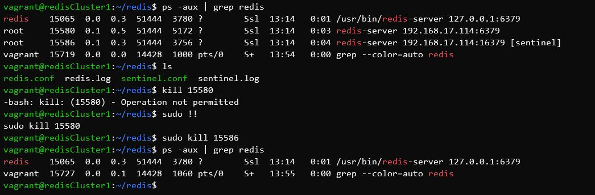

# Table of Content
- [Table of Content](#table-of-content)
- [Deskripsi Tugas](#deskripsi-tugas)
- [Diagram](#diagram)
- [Redis Nodes](#redis-nodes)
  - [Desain Nodes](#desain-nodes)
- [Webserver](#webserver)
  - [Desain Webserver](#desain-webserver)
- [Implementasi Vagrant](#implementasi-vagrant)
  - [Vagrantfile](#vagrantfile)
  - [File Provision](#file-provision)
    - [redisCluster1.sh](#rediscluster1sh)
    - [redisCluster2.sh](#rediscluster2sh)
    - [redisCluster3.sh](#rediscluster3sh)
    - [wordpressWithRedis.sh](#wordpresswithredissh)
    - [wordpressWithoutRedis.sh](#wordpresswithoutredissh)
  - [Redis Config](#redis-config)
    - [redisCluster1.conf](#rediscluster1conf)
    - [redisCluster2.conf](#rediscluster2conf)
    - [redisCluster3.conf](#rediscluster3conf)
  - [Sentinel Config](#sentinel-config)
    - [redisCluster1.conf](#rediscluster1conf-1)
    - [redisCluster2.conf](#rediscluster2conf-1)
    - [redisCluster3.conf](#rediscluster3conf-1)
  - [Mysql Script](#mysql-script)
  - [File lainnya](#file-lainnya)
    - [sources.list](#sourceslist)
    - [Wordpress file](#wordpress-file)
- [Wordpress](#wordpress)
  - [Plugin Redis Object Cache](#plugin-redis-object-cache)
- [JMeter](#jmeter)
  - [50 Koneksi](#50-koneksi)
  - [214 Koneksi](#214-koneksi)
  - [314 Koneksi](#314-koneksi)
  - [Kesimpulan](#kesimpulan)
- [Simulasi Failover](#simulasi-failover)

# Deskripsi Tugas

1. Buatlah sebuah cluster Redis dengan 3 buah node. Tuliskan file konfigurasi yang
digunakan
1. Buatlah sebuah web server, kemudian:
   - Install Wordpress
   - Konfigurasi Wordpress agar menggunakan Redis cache
1. Buatlah sebuah web server lagi dengan konfigurasi hardware yang sama,
kemudian install Wordpress. Pada server ini tidak perlu mengaktifkan Redis
cache
1. Lakukan pengujian menggunakan JMeter untuk mengecek perbedaan load time
dari dua server web tersebut. Buat kesimpulan dari pengujian yang telah
dilakukan.
1. Lakukan pula pengujian untuk menunjukkan bahwa proses fail over
menggunakan Redis Sentinel berhasil. Caranya dengan mematikan salah satu
server Redis dan mengecek siapa master node baru yang terpilih.

# Diagram


# Redis Nodes

## Desain Nodes

| Server | OS | RAM | IP |
| -------------- | ------------ | ------- | -------------- |
| Redis  | ubuntu 18.04 | 1024 MB | 192.168.17.114 |
| Redis  | ubuntu 18.04 | 1024 MB | 192.168.17.115 |
| Redis  | ubuntu 18.04 | 1024 MB | 192.168.17.116 |

Redis dengan ``ip 192.168.17.114`` akan menjadi master pada awalnya.

# Webserver

## Desain Webserver

| Server | OS | RAM | IP |
| -------------- | ------------ | ------- | -------------- |
| Wordpress  | ubuntu 18.04 | 1024 MB | 192.168.17.117 |
| Wordpress  | ubuntu 18.04 | 1024 MB | 192.168.17.118 |

# Implementasi Vagrant

Pada tugas ini saya menggunakan vagrant dan virtual box dalam mensimulasikan beberapa server. Server-server yang dibuat sesuai dengan spesifikasi yang telah dijelaskan diatas.

## Vagrantfile

- Membuat vagrant file dengan menggunakan vagrant init pada direktori aktif.
  ```bash
  vagrant init
  ```

  Memodifikasi Vagrantfile menjadi sebagai berikut:
  ```ruby
    # -*- mode: ruby -*-
    # vi: set ft=ruby :

    Vagrant.configure("2") do |config|

    (1..3).each do |i|
        ipaddress = 113 + i
        config.vm.define "redisCluster#{i}" do |node|
        node.vm.hostname = "redisCluster#{i}"
        node.vm.box = "bento/ubuntu-18.04"
        node.vm.network "private_network", ip: "192.168.17.#{ipaddress}"
        
        node.vm.provider "virtualbox" do |vb|
            vb.name = "redisCluster#{i}"
            vb.gui = false
            vb.memory = "1024"
        end
    
        node.vm.provision "shell", path: "provision/redisCluster#{i}.sh", privileged: false
        end
    end

    config.vm.define "wordpressWithRedis" do |node|
        node.vm.hostname = "wordpressWithRedis"
        node.vm.box = "bento/ubuntu-18.04"
        node.vm.network "private_network", ip: "192.168.17.117"
        
        node.vm.provider "virtualbox" do |vb|
        vb.name = "wordpressWithRedis"
        vb.gui = false
        vb.memory = "1024"
        end

        node.vm.provision "shell", path: "provision/wordpressWithRedis.sh", privileged: false
    end

    config.vm.define "wordpressWithoutRedis" do |node|
        node.vm.hostname = "wordpressWithoutRedis"
        node.vm.box = "bento/ubuntu-18.04"
        node.vm.network "private_network", ip: "192.168.17.118"
        
        node.vm.provider "virtualbox" do |vb|
        vb.name = "wordpressWithoutRedis"
        vb.gui = false
        vb.memory = "1024"
        end

        node.vm.provision "shell", path: "provision/wordpressWithoutRedis.sh", privileged: false
    end

    end
  ```

## File Provision

Setiap virtual machine menggunakan sebuah bash untuk melakukan provision. Bash file untuk setiap virtual machine berbeda beda. Pembagian bash file dapat dilihat pada tabel berikut

| Server | IP | Bash file |
| ------------ | ------------- | ------------- |
| Redis  | 192.168.17.114 | redisCluster1.sh |
| Redis  | 192.168.17.115 | redisCluster2.sh |
| Redis  | 192.168.17.116 | redisCluster2.sh |
| Wordpress | 192.168.17.117 | wordpressWithRedis.sh |
| Wordpress | 192.168.17.118 | wordpressWithoutRedis.sh |

Buatlah folder ``provision`` pada direktori aktif. Letakkan setiap bash file pada direktori ``provision``. Isikan masing - masing bash file sesuai dengan nama file seperti dibawah.

### redisCluster1.sh
```bash
sudo cp /vagrant/sources/sources.list /etc/apt/

# dependency
sudo apt update
sudo apt install build-essential tcl -y
sudo apt install libjemalloc-dev -y
sudo apt install tmux -y

# install redis
sudo apt install redis-server -y

# configuration
cd ~
mkdir redis
cp /vagrant/redis-config/redisCluster1.conf redis/redis.conf
cp /vagrant/sentinel-config/redisCluster1.conf redis/sentinel.conf
touch redis/redis.log
touch redis/sentinel.log

# allow port
sudo ufw allow 6379
sudo ufw allow 26379

# start redis
sudo redis-server redis/redis.conf --daemonize yes
sudo redis-server redis/sentinel.conf --sentinel --daemonize yes
```

### redisCluster2.sh
```bash
sudo cp /vagrant/sources/sources.list /etc/apt/

# dependency
sudo apt update
sudo apt install build-essential tcl -y
sudo apt install libjemalloc-dev -y
sudo apt install tmux -y

# install redis
sudo apt install redis-server -y

# configuration
cd ~
mkdir redis
cp /vagrant/redis-config/redisCluster2.conf redis/redis.conf
cp /vagrant/sentinel-config/redisCluster2.conf redis/sentinel.conf
touch redis/redis.log
touch redis/sentinel.log

# allow port
sudo ufw allow 6379
sudo ufw allow 26379

# start redis
sudo redis-server redis/redis.conf --daemonize yes
sudo redis-server redis/sentinel.conf --sentinel --daemonize yes
```

### redisCluster3.sh
```bash
sudo cp /vagrant/sources/sources.list /etc/apt/

# dependency
sudo apt update
sudo apt install build-essential tcl -y
sudo apt install libjemalloc-dev -y
sudo apt install tmux -y

# install redis
sudo apt install redis-server -y

# configuration
cd ~
mkdir redis
cp /vagrant/redis-config/redisCluster3.conf redis/redis.conf
cp /vagrant/sentinel-config/redisCluster3.conf redis/sentinel.conf
touch redis/redis.log
touch redis/sentinel.log

# allow port
sudo ufw allow 6379
sudo ufw allow 26379

# start redis
sudo redis-server redis/redis.conf --daemonize yes
sudo redis-server redis/sentinel.conf --sentinel --daemonize yes
```

### wordpressWithRedis.sh
```bash
# set source list
sudo cp /vagrant/sources/sources.list /etc/apt/

# dependency
sudo apt update
sudo apt install libaio1 libmecab2 -y

# Setting input for installation
sudo debconf-set-selections <<< 'mysql-community-server mysql-community-server/root-pass password admin'
sudo debconf-set-selections <<< 'mysql-community-server mysql-community-server/re-root-pass password admin'

# lamp
sudo apt install apache2 mysql-server php libapache2-mod-php php-mysql php-curl php-gd php-mbstring php-xml php-xmlrpc php-soap php-intl php-zip -y

# prepare mysql
sudo mysql -u root -padmin < /vagrant/mysql/wordpress.sql

# wordpress
sudo a2enmod rewrite
sudo systemctl restart apache2
cd /tmp
cp /vagrant/sources/latest.tar.gz /tmp
tar xzvf latest.tar.gz
sudo cp -a /tmp/wordpress/. /var/www/html/wordpress
sudo chown -R www-data:www-data /var/www/html/wordpress
sudo chmod -R 755 /var/www/html/wordpress/
sudo mkdir /var/www/html/wordpress/wp-content/uploads
sudo chown -R www-data:www-data /var/www/html/wordpress/wp-content/uploads/
```

### wordpressWithoutRedis.sh
```bash
# set source list
sudo cp /vagrant/sources/sources.list /etc/apt/

# dependency
sudo apt update
sudo apt install libaio1 libmecab2 -y

# Setting input for installation
sudo debconf-set-selections <<< 'mysql-community-server mysql-community-server/root-pass password admin'
sudo debconf-set-selections <<< 'mysql-community-server mysql-community-server/re-root-pass password admin'

# lamp
sudo apt install apache2 mysql-server php libapache2-mod-php php-mysql php-curl php-gd php-mbstring php-xml php-xmlrpc php-soap php-intl php-zip -y

# prepare mysql
sudo mysql -u root -padmin < /vagrant/mysql/wordpress.sql

# wordpress
sudo a2enmod rewrite
sudo systemctl restart apache2
cd /tmp
cp /vagrant/sources/latest.tar.gz /tmp
tar xzvf latest.tar.gz
sudo cp -a /tmp/wordpress/. /var/www/html/wordpress
sudo chown -R www-data:www-data /var/www/html/wordpress
sudo chmod -R 755 /var/www/html/wordpress/
sudo mkdir /var/www/html/wordpress/wp-content/uploads
sudo chown -R www-data:www-data /var/www/html/wordpress/wp-content/uploads/
```

## Redis Config
Setiap Redis Nodes pada replikasi memiliki file configurasi masing - masing. Pembagian file konfigurasi redis dapat dilihat pada tabel berikut

| Server | IP | Bash file |
| ------------ | ------------- | ------------- |
| Redis  | 192.168.17.114 | redisCluster1.conf |
| Redis  | 192.168.17.115 | redisCluster2.conf |
| Redis  | 192.168.17.116 | redisCluster2.conf |

Buatlah direktori ``redis-config`` pada direktori aktif. Isikan masing - masing file konfigurasi sesuai dengan nama file seperti dibawah.

### redisCluster1.conf
```conf
bind 192.168.17.114
port 6379
dir .
logfile "/home/vagrant/redis/redis.conf"
```

### redisCluster2.conf
```conf
bind 192.168.17.115
port 6379
dir .
slaveof 192.168.17.114 6379
logfile "/home/vagrant/redis/redis.conf"
```

### redisCluster3.conf
```conf
bind 192.168.17.116
port 6379
dir .
slaveof 192.168.17.114 6379
logfile "/home/vagrant/redis/redis.conf"
```

## Sentinel Config
Setiap Redis Nodes memiliki Sentinel terinstall didalamnya. Sentinel memiliki file configurasi masing - masing. Pembagian file konfigurasi sentinel dapat dilihat pada tabel berikut

| Server | IP | Bash file |
| ------------ | ------------- | ------------- |
| Redis  | 192.168.17.114 | redisCluster1.conf |
| Redis  | 192.168.17.115 | redisCluster2.conf |
| Redis  | 192.168.17.116 | redisCluster2.conf |

Buatlah direktori ``sentinel-config`` pada direktori aktif. Isikan masing - masing file konfigurasi sesuai dengan nama file seperti dibawah.

### redisCluster1.conf
```conf
bind 192.168.17.114
port 16379

sentinel monitor mymaster 192.168.17.114 6379 2
sentinel down-after-milliseconds mymaster 5000
sentinel parallel-syncs mymaster 1
sentinel failover-timeout mymaster 10000
logfile "/home/vagrant/redis/sentinel.conf"
```

### redisCluster2.conf
```conf
bind 192.168.17.115
port 16379

sentinel monitor mymaster 192.168.17.114 6379 2
sentinel down-after-milliseconds mymaster 5000
sentinel parallel-syncs mymaster 1
sentinel failover-timeout mymaster 10000
logfile "/home/vagrant/redis/sentinel.conf"
```

### redisCluster3.conf
```conf
bind 192.168.17.116
port 16379

sentinel monitor mymaster 192.168.17.114 6379 2
sentinel down-after-milliseconds mymaster 5000
sentinel parallel-syncs mymaster 1
sentinel failover-timeout mymaster 10000
logfile "/home/vagrant/redis/sentinel.conf"
```

## Mysql Script
Wordpress menggunakan mysql pada sistem databasenya, mysql script digunakan untuk menginisialisasi pembuatan database maupun user yang dapat digunakan oleh wordpress.
File script mysql berisi sebagai berikut
```sql
CREATE DATABASE wordpress DEFAULT CHARACTER SET utf8 COLLATE utf8_unicode_ci;
GRANT ALL ON wordpress.* TO 'wordpress'@'localhost' IDENTIFIED BY 'password';
FLUSH PRIVILEGES;
```

User database yang akan digunakan oleh wordpress adalah ``wordpress`` dengan password yaitu ``password``.

## File lainnya
Beberapa file lainnya diperlukan dalam tugas ini seperti:

### sources.list
```
## Note, this file is written by cloud-init on first boot of an instance
## modifications made here will not survive a re-bundle.
## if you wish to make changes you can:
## a.) add 'apt_preserve_sources_list: true' to /etc/cloud/cloud.cfg
##     or do the same in user-data
## b.) add sources in /etc/apt/sources.list.d
## c.) make changes to template file /etc/cloud/templates/sources.list.tmpl

# See http://help.ubuntu.com/community/UpgradeNotes for how to upgrade to
# newer versions of the distribution.
# deb http://archive.ubuntu.com/ubuntu bionic main restricted
# deb-src http://archive.ubuntu.com/ubuntu bionic main restricted

deb http://kambing.ui.ac.id/ubuntu/ bionic main restricted

## Major bug fix updates produced after the final release of the
## distribution.
# deb http://archive.ubuntu.com/ubuntu bionic-updates main restricted
# deb-src http://archive.ubuntu.com/ubuntu bionic-updates main restricted

deb http://kambing.ui.ac.id/ubuntu/ bionic-updates main restricted

## N.B. software from this repository is ENTIRELY UNSUPPORTED by the Ubuntu
## team. Also, please note that software in universe WILL NOT receive any
## review or updates from the Ubuntu security team.
# deb http://archive.ubuntu.com/ubuntu bionic universe
# deb-src http://archive.ubuntu.com/ubuntu bionic universe
# deb http://archive.ubuntu.com/ubuntu bionic-updates universe
# deb-src http://archive.ubuntu.com/ubuntu bionic-updates universe

deb http://kambing.ui.ac.id/ubuntu/ bionic universe
deb http://kambing.ui.ac.id/ubuntu/ bionic-updates universe

## N.B. software from this repository is ENTIRELY UNSUPPORTED by the Ubuntu
## team, and may not be under a free licence. Please satisfy yourself as to
## your rights to use the software. Also, please note that software in
## multiverse WILL NOT receive any review or updates from the Ubuntu
## security team.
# deb http://archive.ubuntu.com/ubuntu bionic multiverse
# deb-src http://archive.ubuntu.com/ubuntu bionic multiverse
# deb http://archive.ubuntu.com/ubuntu bionic-updates multiverse
# deb-src http://archive.ubuntu.com/ubuntu bionic-updates multiverse

deb http://kambing.ui.ac.id/ubuntu/ bionic multiverse
deb http://kambing.ui.ac.id/ubuntu/ bionic-updates multiverse

## N.B. software from this repository may not have been tested as
## extensively as that contained in the main release, although it includes
## newer versions of some applications which may provide useful features.
## Also, please note that software in backports WILL NOT receive any review
## or updates from the Ubuntu security team.
# deb http://archive.ubuntu.com/ubuntu bionic-backports main restricted universe multiverse
# deb-src http://archive.ubuntu.com/ubuntu bionic-backports main restricted universe multiverse

deb http://kambing.ui.ac.id/ubuntu/ bionic-backports main restricted universe multiverse

## Uncomment the following two lines to add software from Canonical's
## 'partner' repository.
## This software is not part of Ubuntu, but is offered by Canonical and the
## respective vendors as a service to Ubuntu users.
# deb http://archive.canonical.com/ubuntu bionic partner
# deb-src http://archive.canonical.com/ubuntu bionic partner

# deb http://security.ubuntu.com/ubuntu bionic-security main restricted
# deb-src http://security.ubuntu.com/ubuntu bionic-security main restricted
# deb http://security.ubuntu.com/ubuntu bionic-security universe
# deb-src http://security.ubuntu.com/ubuntu bionic-security universe
# deb http://security.ubuntu.com/ubuntu bionic-security multiverse
# deb-src http://security.ubuntu.com/ubuntu bionic-security multiverse

deb http://kambing.ui.ac.id/ubuntu/ bionic-security main restricted
deb http://kambing.ui.ac.id/ubuntu/ bionic-security universe
deb http://kambing.ui.ac.id/ubuntu/ bionic-security multiverse
```

### Wordpress file

[Wordpress](sources/latest.tar.gz)

# Wordpress

Pastikan wordpress telah berjalan dengan baik dengan cara mengakses ip ``192.168.17.117/wordpress`` dan ``192.168.17.117/wordpress`` untuk memastikan website jalan. Apabila anda membuka pertama kali maka akan diminta untuk setting wordpress untuk pertama kali.

Wordpress akan terlihat seperti dibawah ini apabila telah selesai setting di awal.


## Plugin Redis Object Cache

Install Plugin redis seperti gambar dibawah ini


Edit file wp-config.php dengan menambahkan beberapa line berikut dibawah 'WP_COLLATE'
```
define( 'WP_REDIS_CLIENT', 'predis' );
define( 'WP_REDIS_SENTINEL', 'mymaster' );
define( 'WP_REDIS_SERVERS', [
    'tcp://192.168.17.114:16379',
    'tcp://192.168.17.115:16379',
    'tcp://192.168.17.116:16379',
] );
```
Pastikan status ``connected`` setelah menambahkan konfigurasi berikut.


# JMeter

Konfigurasi request yang digunakan pada JMeter adalah sebagai berikut
- Request pada wordpress dengan plugins redis

- Request pada wordpress tanpa redis


## 50 Koneksi
Hasil yang didapat dalam 50 request secara berturut - turut


## 214 Koneksi
Hasil yang didapat dalam 214 request secara berturut - turut


## 314 Koneksi
Hasil yang didapat dalam 314 request secara berturut - turut


## Kesimpulan

# Simulasi Failover

Status replikasi pada sentinel 2 saat semua server hidup. Status replikasi dapat di check dengan cara

```bash
redis-cli -h 192.168.17.115 -p 6379
info replication
```


Matikan server master pada ip ``192.168.17.114``



Check status replikasi pada node 2


Terlihat bahwa node 2 telah diangkat menjadi master yang baru setelah master yang sebelumnya mati.