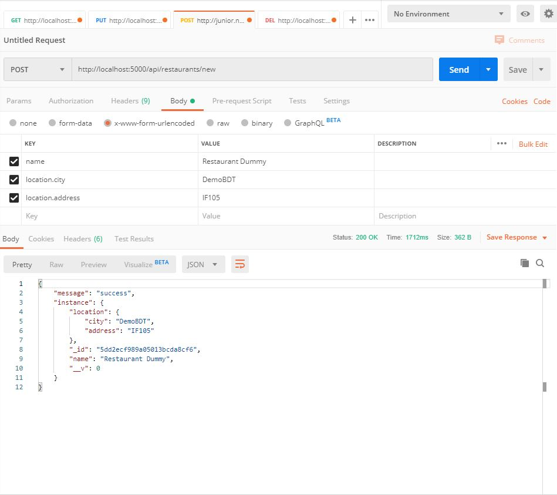
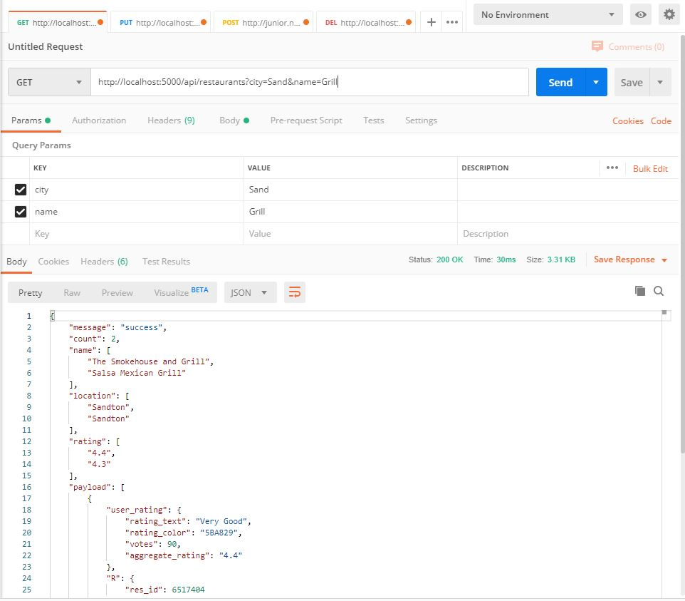
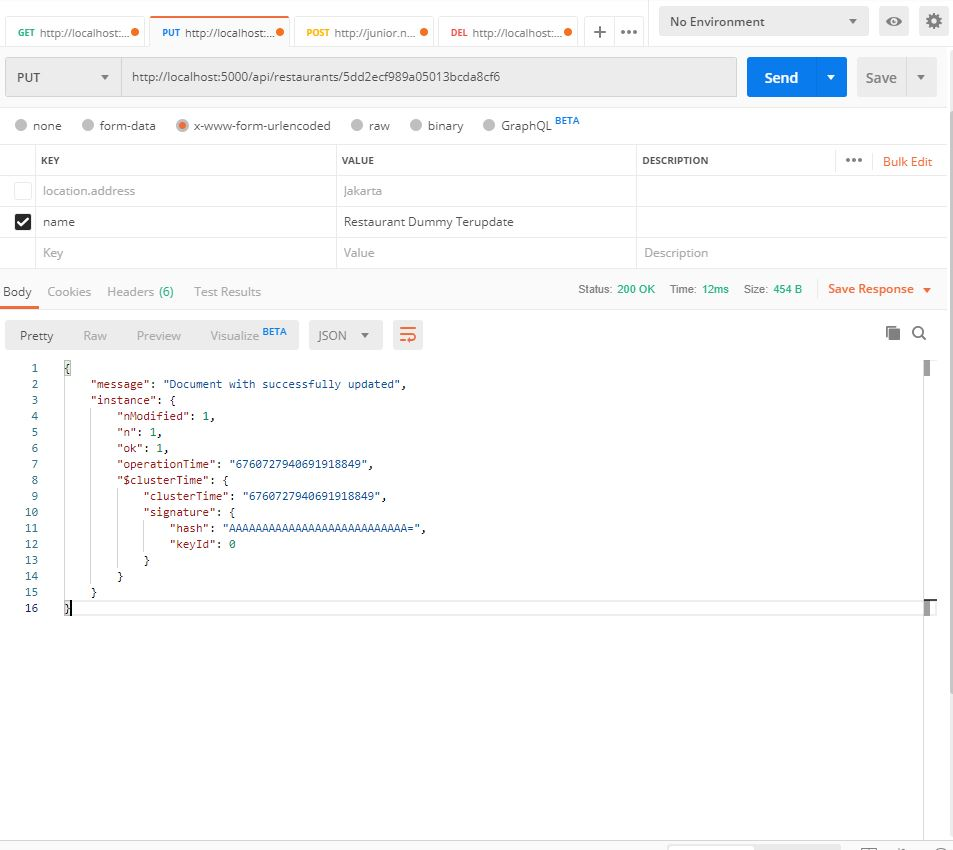
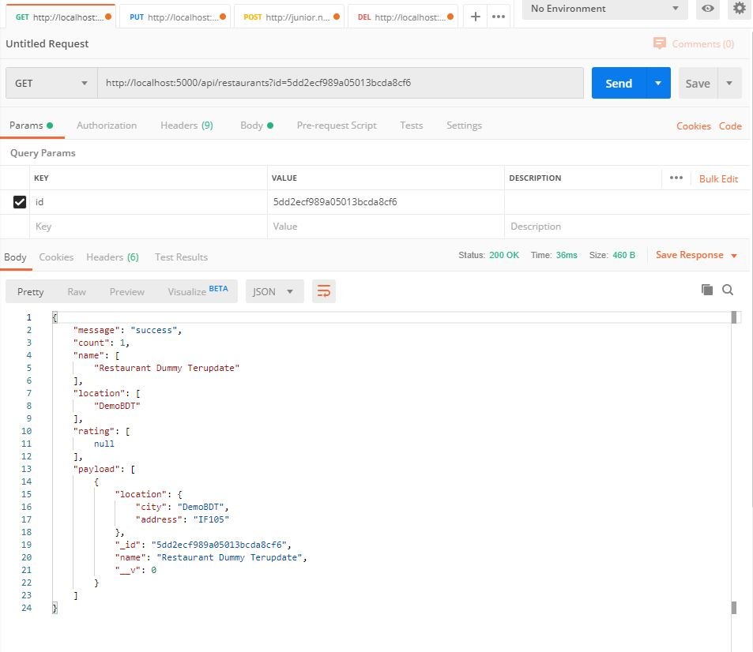
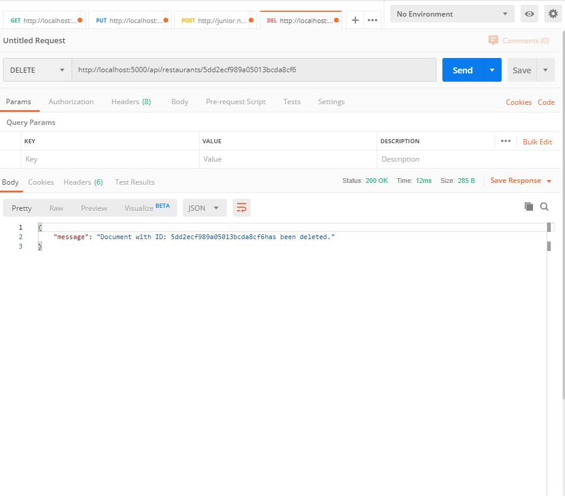
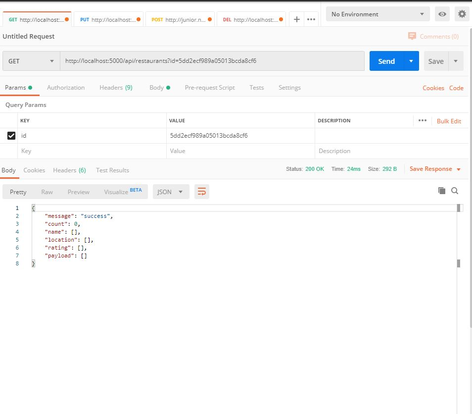
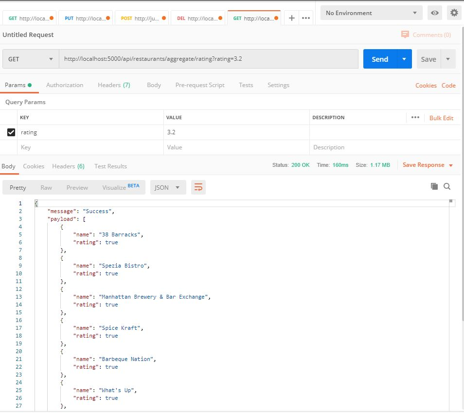
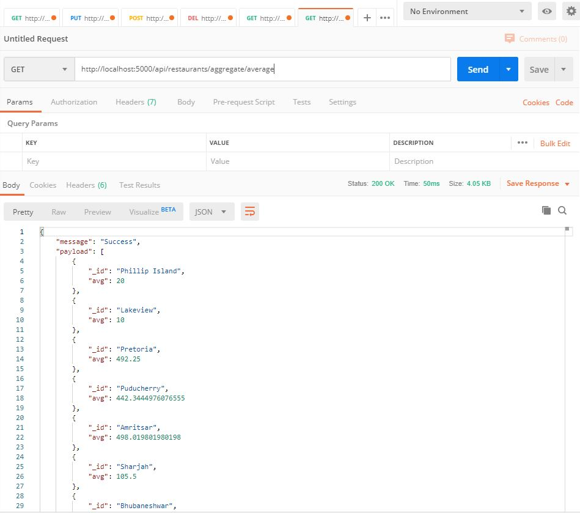
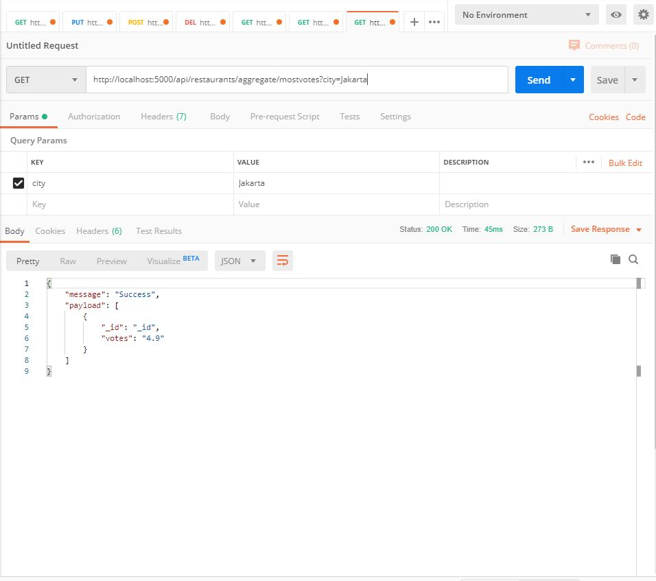

# Table of Content
- [Table of Content](#table-of-content)
- [Deskripsi Tugas](#deskripsi-tugas)
  - [Implementasi Cluster MongoDB](#implementasi-cluster-mongodb)
  - [Menggunakan dataset](#menggunakan-dataset)
  - [Implementasi aplikasi CRUD](#implementasi-aplikasi-crud)
- [Desain Cluster](#desain-cluster)
- [Implementasi Vagrant](#implementasi-vagrant)
  - [Vagrant](#vagrant)
  - [Bash File](#bash-file)
  - [File config](#file-config)
  - [File pendukung](#file-pendukung)
  - [Eksekusi vagrant](#eksekusi-vagrant)
- [Konfigurasi Mongo](#konfigurasi-mongo)
  - [Mongo Config 1](#mongo-config-1)
  - [Mongo Config 2](#mongo-config-2)
  - [Mongo Query Router](#mongo-query-router)
  - [Mongo Shard 1](#mongo-shard-1)
  - [Mongo Shard 2](#mongo-shard-2)
  - [Mongo Shard 3](#mongo-shard-3)
- [Dataset](#dataset)
  - [Parsing dataset](#parsing-dataset)
  - [Import JSON ke mongodb](#import-json-ke-mongodb)
- [Implementasi CRUD](#implementasi-crud)
  - [Create](#create)
  - [Read](#read)
  - [Update](#update)
  - [Delete](#delete)
  - [Agregasi](#agregasi)

# Deskripsi Tugas
## Implementasi Cluster MongoDB
- Menggunakan versi MongoDB: 4.2
- Dapat menggunakan Vagrant/Docker
- Cluster terdiri dari:
    - Config server: 2
    - Data/shard server: 3
    - Query router: 1
## Menggunakan dataset
- Menggunakan dataset berformat CSV atau JSON dengan ukuran > 1000 baris
- Import ke dalam server MongoDB
## Implementasi aplikasi CRUD
- Menggunakan bahasa pemrograman yang support dengan connector MongoDB
- Menggunakan Web/API/Scripting
- Harus ada operasi CRUD
- Untuk proses read, harus melibatkan juga agregasi
  - Minimal ada 2 contoh query agregasi

# Desain Cluster

| Server | OS | RAM | IP |
| ------------ | ------------- | ------------ | ------------- |
| Mongo Config  | ubuntu 18.04 | 1024 MB | 192.168.17.114 |
| Mongo Config  | ubuntu 18.04 | 1024 MB | 192.168.17.115 |
| Mongo Query Router  | ubuntu 18.04 | 1024 MB | 192.168.17.116 |
| Mongo Shard  | ubuntu 18.04 | 1024 MB | 192.168.17.117 |
| Mongo Shard  | ubuntu 18.04 | 1024 MB | 192.168.17.118 |
| Mongo Shard  | ubuntu 18.04 | 1024 MB | 192.168.17.119 |

# Implementasi Vagrant

## Vagrant

- Membuat vagrant file dengan menggunakan vagrant init pada direktori aktif.
  ```bash
  vagrant init
  ```
- Memodifikasi Vagrantfile menjadi sebagai berikut:
  ```ruby
    # -*- mode: ruby -*-
    # vi: set ft=ruby :

    Vagrant.configure("2") do |config|

    config.vm.define "mongoConfig1" do |mongoConfig1|
        mongoConfig1.vm.hostname = "mongoConfig1"
        mongoConfig1.vm.box = "bento/ubuntu-18.04"
        mongoConfig1.vm.network "private_network", ip: "192.168.17.114"
        
        mongoConfig1.vm.provider "virtualbox" do |vb|
        vb.name = "mongoConfig1"
        vb.gui = false
        vb.memory = "1024"
        end

        mongoConfig1.vm.provision "shell", path: "provision/mongoConfig1.sh", privileged: false
    end

    config.vm.define "mongoConfig2" do |mongoConfig2|
        mongoConfig2.vm.hostname = "mongoConfig2"
        mongoConfig2.vm.box = "bento/ubuntu-18.04"
        mongoConfig2.vm.network "private_network", ip: "192.168.17.115"
        
        mongoConfig2.vm.provider "virtualbox" do |vb|
        vb.name = "mongoConfig2"
        vb.gui = false
        vb.memory = "1024"
        end

        mongoConfig2.vm.provision "shell", path: "provision/mongoConfig2.sh", privileged: false
    end

    config.vm.define "mongoQueryRouter" do |mongoQueryRouter|
        mongoQueryRouter.vm.hostname = "mongoQueryRouter"
        mongoQueryRouter.vm.box = "bento/ubuntu-18.04"
        mongoQueryRouter.vm.network "private_network", ip: "192.168.17.116"
        
        mongoQueryRouter.vm.provider "virtualbox" do |vb|
        vb.name = "mongoQueryRouter"
        vb.gui = false
        vb.memory = "1024"
        end

        mongoQueryRouter.vm.provision "shell", path: "provision/mongoQueryRouter.sh", privileged: false
    end

    config.vm.define "mongoShard1" do |mongoShard1|
        mongoShard1.vm.hostname = "mongoShard1"
        mongoShard1.vm.box = "bento/ubuntu-18.04"
        mongoShard1.vm.network "private_network", ip: "192.168.17.117"
            
        mongoShard1.vm.provider "virtualbox" do |vb|
        vb.name = "mongoShard1"
        vb.gui = false
        vb.memory = "1024"
        end

        mongoShard1.vm.provision "shell", path: "provision/mongoShard1.sh", privileged: false
    end

    config.vm.define "mongoShard2" do |mongoShard2|
        mongoShard2.vm.hostname = "mongoShard2"
        mongoShard2.vm.box = "bento/ubuntu-18.04"
        mongoShard2.vm.network "private_network", ip: "192.168.17.118"
        
        mongoShard2.vm.provider "virtualbox" do |vb|
        vb.name = "mongoShard2"
        vb.gui = false
        vb.memory = "1024"
        end

        mongoShard2.vm.provision "shell", path: "provision/mongoShard2.sh", privileged: false
    end

    config.vm.define "mongoShard3" do |mongoShard3|
        mongoShard3.vm.hostname = "mongoShard3"
        mongoShard3.vm.box = "bento/ubuntu-18.04"
        mongoShard3.vm.network "private_network", ip: "192.168.17.119"
            
        mongoShard3.vm.provider "virtualbox" do |vb|
        vb.name = "mongoShard3"
        vb.gui = false
        vb.memory = "1024"
        end

        mongoShard3.vm.provision "shell", path: "provision/mongoShard3.sh", privileged: false
    end

    end

  ```

## Bash File

Setiap virtual machine menggunakan sebuah bash untuk melakukan provision. Bash file untuk setiap virtual machine berbeda beda. Pembagian bash file dapat dilihat pada tabel berikut

| Server | Bash file |
| ------------ | ------------- |
| Mongo Config  | mongoConfig1.sh |
| Mongo Config  | mongoConfig2.sh |
| Mongo Query Router  | mongoQueryRouter.sh |
| Mongo Shard  | mongoShard1.sh |
| Mongo Shard  | mongoShard2.sh |
| Mongo Shard  | mongoShard3.sh |

Letakkan setiap bash file pada direktori provision. Isikan masing - masing bash file sesuai dengan nama file seperti dibawah.

1. mongoConfig1.sh
   ```bash
    # Add hostname
    sudo cp /vagrant/sources/hosts /etc/hosts

    # Copy APT sources list
    sudo cp /vagrant/sources/sources.list /etc/apt/
    sudo cp /vagrant/sources/mongodb-org-4.2.list /etc/apt/sources.list.d/

    # Add MongoDB repo key
    sudo apt-get install gnupg
    wget -qO - https://www.mongodb.org/static/pgp/server-4.2.asc | sudo apt-key add -

    # Update Repository
    sudo apt-get update
    # sudo apt-get upgrade -y

    # Install MongoDB
    sudo apt-get install -y mongodb-org

    sudo systemctl start mongod

    # sudo cp /vagrant/config/mongodConfig1.conf /etc/mongod.conf

    # sudo systemctl restart mongod

    # mongo mongoConfig1:27019 < /vagrant/scriptmongo/config1
   ```

2. mongoConfig2.sh
    ```bash
    # Add hostname
    sudo cp /vagrant/sources/hosts /etc/hosts

    # Copy APT sources list
    sudo cp /vagrant/sources/sources.list /etc/apt/
    sudo cp /vagrant/sources/mongodb-org-4.2.list /etc/apt/sources.list.d/

    # Add MongoDB repo key
    sudo apt-get install gnupg
    wget -qO - https://www.mongodb.org/static/pgp/server-4.2.asc | sudo apt-key add -

    # Update Repository
    sudo apt-get update
    # sudo apt-get upgrade -y

    # Install MongoDB
    sudo apt-get install -y mongodb-org

    sudo systemctl start mongod

    # sudo cp /vagrant/config/mongodConfig2.conf /etc/mongod.conf

    # sudo systemctl restart mongod
    ```
3. mongoQueryRouter.sh
    ```bash
    # Add hostname
    sudo cp /vagrant/sources/hosts /etc/hosts

    # Copy APT sources list
    sudo cp /vagrant/sources/sources.list /etc/apt/
    sudo cp /vagrant/sources/mongodb-org-4.2.list /etc/apt/sources.list.d/

    # Add MongoDB repo key
    sudo apt-get install gnupg
    wget -qO - https://www.mongodb.org/static/pgp/server-4.2.asc | sudo apt-key add -

    # Update Repository
    sudo apt-get update
    # sudo apt-get upgrade -y

    # Install MongoDB
    sudo apt-get install -y mongodb-org

    sudo systemctl start mongod

    sudo systemctl stop mongod

    # sudo cp /vagrant/config/mongosQueryRouter.service /lib/systemd/system/mongos.service
    # sudo cp /vagrant/config/mongosQueryRouter.conf /etc/mongos.conf

    # sudo systemctl enable mongos.service
    # sleep 2
    # sudo systemctl start mongos
    # sleep 2
    # sudo systemctl status mongos
    ```
4. mongoShard1.sh
    ```bash
    # Add hostname
    sudo cp /vagrant/sources/hosts /etc/hosts

    # Copy APT sources list
    sudo cp /vagrant/sources/sources.list /etc/apt/
    sudo cp /vagrant/sources/mongodb-org-4.2.list /etc/apt/sources.list.d/

    # Add MongoDB repo key
    sudo apt-get install gnupg
    wget -qO - https://www.mongodb.org/static/pgp/server-4.2.asc | sudo apt-key add -

    # Update Repository
    sudo apt-get update
    # sudo apt-get upgrade -y

    # Install MongoDB
    sudo apt-get install -y mongodb-org

    sudo systemctl start mongod

    # sudo cp /vagrant/config/mongodShard1.conf /etc/mongod.conf

    # sudo systemctl restart mongod

    # mongo mongoQueryRouter:27017 -u mongo-admin -pyoganteng --authenticationDatabase admin < /vagrant/scriptmongo/queryRouter
    ```
5. mongoShard2.sh
    ```bash
    # Add hostname
    sudo cp /vagrant/sources/hosts /etc/hosts

    # Copy APT sources list
    sudo cp /vagrant/sources/sources.list /etc/apt/
    sudo cp /vagrant/sources/mongodb-org-4.2.list /etc/apt/sources.list.d/

    # Add MongoDB repo key
    sudo apt-get install gnupg
    wget -qO - https://www.mongodb.org/static/pgp/server-4.2.asc | sudo apt-key add -

    # Update Repository
    sudo apt-get update
    # sudo apt-get upgrade -y

    # Install MongoDB
    sudo apt-get install -y mongodb-org

    sudo systemctl start mongod

    # sudo cp /vagrant/config/mongodShard2.conf /etc/mongod.conf

    # sudo systemctl restart mongod
    ```
6. mongoShard3.sh
    ```bash
    # Add hostname
    sudo cp /vagrant/sources/hosts /etc/hosts

    # Copy APT sources list
    sudo cp /vagrant/sources/sources.list /etc/apt/
    sudo cp /vagrant/sources/mongodb-org-4.2.list /etc/apt/sources.list.d/

    # Add MongoDB repo key
    sudo apt-get install gnupg
    wget -qO - https://www.mongodb.org/static/pgp/server-4.2.asc | sudo apt-key add -

    # Update Repository
    sudo apt-get update
    # sudo apt-get upgrade -y

    # Install MongoDB
    sudo apt-get install -y mongodb-org

    sudo systemctl start mongod

    # sudo cp /vagrant/config/mongodShard3.conf /etc/mongod.conf

    # sudo systemctl restart mongod
    ```

## File config

Setiap virtual machine akan menjalakan service mongod atau mongos. Setiap service mongos dan mongod memiliki konfigurasi yang berbeda - beda.

Pembagian file config untuk setiap virtual machine dapat dilihat pada tabel berikut:
| Server | Config file |
| ------------ | ------------- |
| Mongo Config  | mongodConfig1.conf |
| Mongo Config  | mongodConfig2.conf |
| Mongo Query Router  | mongosQueryRouter.conf + mongosQueryRouter.service|
| Mongo Shard  | mongodShard1.conf |
| Mongo Shard  | mongodShard2.conf |
| Mongo Shard  | mongodShard3.conf |

Buatlah folder ``config`` pada direktori aktif. Kemudian tambahkan file berikut:

1. mongodConfig1.conf
    ```conf
    # mongod.conf

    # for documentation of all options, see:
    #   http://docs.mongodb.org/manual/reference/configuration-options/

    # Where and how to store data.
    storage:
      dbPath: /var/lib/mongodb
      journal:
        enabled: true
    #  engine:
    #  mmapv1:
    #  wiredTiger:

    # where to write logging data.
    systemLog:
      destination: file
      logAppend: true
      path: /var/log/mongodb/mongod.log

    # network interfaces
    net:
      port: 27019
      bindIp: 192.168.17.114


    # how the process runs
    processManagement:
      timeZoneInfo: /usr/share/zoneinfo

    #security:

    #operationProfiling:

    replication:
      replSetName: configReplSet

    sharding:
      clusterRole: "configsvr"

    ## Enterprise-Only Options:

    #auditLog:

    #snmp:
    ```
2. mongodConfig2.conf
    ```
    # mongod.conf

    # for documentation of all options, see:
    #   http://docs.mongodb.org/manual/reference/configuration-options/

    # Where and how to store data.
    storage:
      dbPath: /var/lib/mongodb
      journal:
        enabled: true
    #  engine:
    #  mmapv1:
    #  wiredTiger:

    # where to write logging data.
    systemLog:
      destination: file
      logAppend: true
      path: /var/log/mongodb/mongod.log

    # network interfaces
    net:
      port: 27019
      bindIp: 192.168.17.115


    # how the process runs
    processManagement:
      timeZoneInfo: /usr/share/zoneinfo

    #security:

    #operationProfiling:

    replication:
      replSetName: configReplSet

    sharding:
      clusterRole: "configsvr"

    ## Enterprise-Only Options:

    #auditLog:

    #snmp:
    ```

3. mongosQueryRouter.conf
    ```
    # where to write logging data.
    systemLog:
      destination: file
      logAppend: true
      path: /var/log/mongodb/mongos.log

    # network interfaces
    net:
      port: 27017
      bindIp: 192.168.17.116

    sharding:
      configDB: configReplSet/mongoConfig1:27019,mongoConfig2:27019

    ```
4. mongosQueryRouter.service
    ```
    [Unit]
    Description=Mongo Cluster Router
    After=network.target

    [Service]
    User=mongodb
    Group=mongodb
    ExecStart=/usr/bin/mongos --config /etc/mongos.conf
    # file size
    LimitFSIZE=infinity
    # cpu time
    LimitCPU=infinity
    # virtual memory size
    LimitAS=infinity
    # open files
    LimitNOFILE=64000
    # processes/threads
    LimitNPROC=64000
    # total threads (user+kernel)
    TasksMax=infinity
    TasksAccounting=false

    [Install]
    WantedBy=multi-user.target

    ```
5. mongodShard1.conf
    ```
    # mongod.conf

    # for documentation of all options, see:
    #   http://docs.mongodb.org/manual/reference/configuration-options/

    # Where and how to store data.
    storage:
    dbPath: /var/lib/mongodb
    journal:
        enabled: true
    #  engine:
    #  mmapv1:
    #  wiredTiger:

    # where to write logging data.
    systemLog:
      destination: file
      logAppend: true
      path: /var/log/mongodb/mongod.log

    # network interfaces
    net:
      port: 27017
      bindIp: 192.168.17.117


    # how the process runs
    processManagement:
      timeZoneInfo: /usr/share/zoneinfo

    #security:

    #operationProfiling:

    #replication:

    sharding:
      clusterRole: "shardsvr"

    ## Enterprise-Only Options:

    #auditLog:

    #snmp:

    ```
6. mongodShard2.conf
    ```
    # mongod.conf

    # for documentation of all options, see:
    #   http://docs.mongodb.org/manual/reference/configuration-options/

    # Where and how to store data.
    storage:
      dbPath: /var/lib/mongodb
      journal:
        enabled: true
    #  engine:
    #  mmapv1:
    #  wiredTiger:

    # where to write logging data.
    systemLog:
      destination: file
      logAppend: true
      path: /var/log/mongodb/mongod.log

    # network interfaces
    net:
      port: 27017
      bindIp: 192.168.17.118


    # how the process runs
    processManagement:
      timeZoneInfo: /usr/share/zoneinfo

    #security:

    #operationProfiling:

    #replication:

    sharding:
      clusterRole: "shardsvr"

    ## Enterprise-Only Options:

    #auditLog:

    #snmp:
    ```
7. mongodShard3.conf
    ```
    # mongod.conf

    # for documentation of all options, see:
    #   http://docs.mongodb.org/manual/reference/configuration-options/

    # Where and how to store data.
    storage:
      dbPath: /var/lib/mongodb
      journal:
        enabled: true
    #  engine:
    #  mmapv1:
    #  wiredTiger:

    # where to write logging data.
    systemLog:
      destination: file
      logAppend: true
      path: /var/log/mongodb/mongod.log

    # network interfaces
    net:
      port: 27017
      bindIp: 192.168.17.119


    # how the process runs
    processManagement:
      timeZoneInfo: /usr/share/zoneinfo

    #security:

    #operationProfiling:

    #replication:

    sharding:
      clusterRole: "shardsvr"

    ## Enterprise-Only Options:

    #auditLog:

    #snmp:

    ```

## File pendukung

Beberapa file pendukung diperlukan dalam bash file masing masing virtual machine. File pendukung terdiri dari file ``hosts`` yang berisi hostname beserta ip masing masing server, ``mongodb-org-4.2.list`` yang berisi source repo mongodb, dan ``source.list`` berisi source ubuntu pada mirror kambing.ui.ac.id.

Buatlah folder ``sources`` pada direktori aktif. Kemudian tambahkan file berikut:

1. hosts
   ```
    192.168.17.114 mongoConfig1
    192.168.17.115 mongoConfig2
    192.168.17.116 mongoQueryRouter
    192.168.17.117 mongoShard1
    192.168.17.118 mongoShard2
    192.168.17.119 mongoShard3
   ```
2. mongodb-org-4.2.list
    deb [ arch=amd64 ] https://repo.mongodb.org/apt/ubuntu bionic/mongodb-org/4.2 multiverse
3. source.list
    ``` 
    ## Note, this file is written by cloud-init on first boot of an instance
    ## modifications made here will not survive a re-bundle.
    ## if you wish to make changes you can:
    ## a.) add 'apt_preserve_sources_list: true' to /etc/cloud/cloud.cfg
    ##     or do the same in user-data
    ## b.) add sources in /etc/apt/sources.list.d
    ## c.) make changes to template file /etc/cloud/templates/sources.list.tmpl

    # See http://help.ubuntu.com/community/UpgradeNotes for how to upgrade to
    # newer versions of the distribution.
    # deb http://archive.ubuntu.com/ubuntu bionic main restricted
    # deb-src http://archive.ubuntu.com/ubuntu bionic main restricted

    deb http://kambing.ui.ac.id/ubuntu/ bionic main restricted

    ## Major bug fix updates produced after the final release of the
    ## distribution.
    # deb http://archive.ubuntu.com/ubuntu bionic-updates main restricted
    # deb-src http://archive.ubuntu.com/ubuntu bionic-updates main restricted

    deb http://kambing.ui.ac.id/ubuntu/ bionic-updates main restricted

    ## N.B. software from this repository is ENTIRELY UNSUPPORTED by the Ubuntu
    ## team. Also, please note that software in universe WILL NOT receive any
    ## review or updates from the Ubuntu security team.
    # deb http://archive.ubuntu.com/ubuntu bionic universe
    # deb-src http://archive.ubuntu.com/ubuntu bionic universe
    # deb http://archive.ubuntu.com/ubuntu bionic-updates universe
    # deb-src http://archive.ubuntu.com/ubuntu bionic-updates universe

    deb http://kambing.ui.ac.id/ubuntu/ bionic universe
    deb http://kambing.ui.ac.id/ubuntu/ bionic-updates universe

    ## N.B. software from this repository is ENTIRELY UNSUPPORTED by the Ubuntu
    ## team, and may not be under a free licence. Please satisfy yourself as to
    ## your rights to use the software. Also, please note that software in
    ## multiverse WILL NOT receive any review or updates from the Ubuntu
    ## security team.
    # deb http://archive.ubuntu.com/ubuntu bionic multiverse
    # deb-src http://archive.ubuntu.com/ubuntu bionic multiverse
    # deb http://archive.ubuntu.com/ubuntu bionic-updates multiverse
    # deb-src http://archive.ubuntu.com/ubuntu bionic-updates multiverse

    deb http://kambing.ui.ac.id/ubuntu/ bionic multiverse
    deb http://kambing.ui.ac.id/ubuntu/ bionic-updates multiverse

    ## N.B. software from this repository may not have been tested as
    ## extensively as that contained in the main release, although it includes
    ## newer versions of some applications which may provide useful features.
    ## Also, please note that software in backports WILL NOT receive any review
    ## or updates from the Ubuntu security team.
    # deb http://archive.ubuntu.com/ubuntu bionic-backports main restricted universe multiverse
    # deb-src http://archive.ubuntu.com/ubuntu bionic-backports main restricted universe multiverse

    deb http://kambing.ui.ac.id/ubuntu/ bionic-backports main restricted universe multiverse

    ## Uncomment the following two lines to add software from Canonical's
    ## 'partner' repository.
    ## This software is not part of Ubuntu, but is offered by Canonical and the
    ## respective vendors as a service to Ubuntu users.
    # deb http://archive.canonical.com/ubuntu bionic partner
    # deb-src http://archive.canonical.com/ubuntu bionic partner

    # deb http://security.ubuntu.com/ubuntu bionic-security main restricted
    # deb-src http://security.ubuntu.com/ubuntu bionic-security main restricted
    # deb http://security.ubuntu.com/ubuntu bionic-security universe
    # deb-src http://security.ubuntu.com/ubuntu bionic-security universe
    # deb http://security.ubuntu.com/ubuntu bionic-security multiverse
    # deb-src http://security.ubuntu.com/ubuntu bionic-security multiverse

    deb http://kambing.ui.ac.id/ubuntu/ bionic-security main restricted
    deb http://kambing.ui.ac.id/ubuntu/ bionic-security universe
    deb http://kambing.ui.ac.id/ubuntu/ bionic-security multiverse
    ```

## Eksekusi vagrant

Eksekusi ``Vagrantfile`` dengan menjalankan
```bash
vagrant up
```
pada direktori Vagrantfile.

Tunggu hingga semua virtual machine telah di up dan dapat digunakan

# Konfigurasi Mongo

Setelah semua virtual machine telah siap digunakan. Konfigurasi virtual machine satu persatu.

## Mongo Config 1

Akses terminal dari virtual machine mongoConfig1 dengan menggunakan perintah
```bash
vagrant ssh mongoConfig1
```
pada direktori Vagrantfile.

Pada terminal jalankan perintah
```bash
mongo
use admin
db.createUser({user: "mongo-admin", pwd: "yoganteng", roles:[{role: "root", db: "admin"}]})
exit
sudo cp /vagrant/config/mongodConfig1.conf /etc/mongod.conf
sudo systemctl restart mongod
```

Kemudian tinggalkan sebentar dan lanjutkan mengkonfigurasi mongoConfig2.

Setelah selesai mengkonfigurasi mongoConfig2, pada terminal eksekusi perintah berikut:

```bash
mongo mongoConfig1:27019 -u mongo-admin -pyoganteng --authenticationDatabase admin
rs.initiate( { _id: "configReplSet", configsvr: true, members: [ { _id: 0, host: "mongoConfig1:27019" }, { _id: 1, host: "mongoConfig2:27019" } ] } )
```

## Mongo Config 2
Akses terminal dari virtual machine mongoConfig1 dengan menggunakan perintah
```bash
vagrant ssh mongoConfig2
```
pada direktori Vagrantfile.

Pada terminal jalankan perintah
```bash
sudo cp /vagrant/config/mongodConfig2.conf /etc/mongod.conf
sudo systemctl restart mongod
```

## Mongo Query Router
Akses terminal dari virtual machine mongoConfig1 dengan menggunakan perintah
```bash
vagrant ssh mongoQueryRouter
```

Pada terminal jalankan perintah
```bash
sudo cp /vagrant/config/mongosQueryRouter.service /lib/systemd/system/mongos.service
sudo cp /vagrant/config/mongosQueryRouter.conf /etc/mongos.conf

sudo systemctl enable mongos.service
sudo systemctl start mongos
sudo systemctl status mongos
```

## Mongo Shard 1
Akses terminal dari virtual machine mongoShard1 dengan menggunakan perintah
```bash
vagrant ssh mongoShard1
```
pada direktori Vagrantfile.

Pada terminal jalankan perintah
```bash
sudo cp /vagrant/config/mongodShard1.conf /etc/mongod.conf
sudo systemctl restart mongod
```

## Mongo Shard 2
Akses terminal dari virtual machine mongoShard2 dengan menggunakan perintah
```bash
vagrant ssh mongoShard2
```
pada direktori Vagrantfile.

Pada terminal jalankan perintah
```bash
sudo cp /vagrant/config/mongodShard2.conf /etc/mongod.conf
sudo systemctl restart mongod
```

## Mongo Shard 3
Akses terminal dari virtual machine mongoShard3 dengan menggunakan perintah
```bash
vagrant ssh mongoShard3
```
pada direktori Vagrantfile.

Pada terminal jalankan perintah
```bash
sudo cp /vagrant/config/mongodShard3.conf /etc/mongod.conf
sudo systemctl restart mongod
mongo mongoQueryRouter:27017 -u mongo-admin -pyoganteng --authenticationDatabase admin

sh.addShard( "mongoShard1:27017" )
sh.addShard( "mongoShard2:27017" )
sh.addShard( "mongoShard3:27017" )

use bdt
sh.enableSharding("bdt")

use bdt
db.restaurants.ensureIndex( { _id : "hashed" } )
sh.shardCollection( "bdt.restaurants", { "_id" : "hashed" } )
```

# Dataset

## Parsing dataset

Download folder ``zomato-restaurants-data`` pada repositori ini.
Jalankan script `parse.py` dengan perintah

```bash
python parse.py
```

File baru `parsed.json` akan muncul.

## Import JSON ke mongodb

Akses terminal dari virtual machine mongoShard1 dengan menggunakan perintah
```bash
vagrant ssh mongoShard1
```

Pada terminal jalankan perintah
```bash
sudo cp /vagrant/zomato-restaurants-data/parsed.json ~
mongoimport -h mongoQueryRouter:27017 --db bdt --collection restaurants --file parsed.json --jsonArray
```

# Implementasi CRUD

Aplikasi yang digunakan merupakan aplikasi REST API sederhana yang dibuat menggunakan express js. Aplikasi dapat di test dengan menggunakan api tester. Saya menggunakan aplikasi postman untuk menguji aplikasi yang dibuat.

## Create
Endpoint yang digunakan adalah /api/restaurants/new dengan body request berupa x-www-form-data-urlencoded


## Read
Endpoint yang digunakan adalah /api/restaurants.
Parameter get yang dapat ditambahkan yaitu
- name
- city
- address
  
Maka akan melakukan query berdasarkan regex parameter get.


## Update
Endpoint yang digunakan adalah /api/restaurants/:id dengan method request yaitu PUT.


Hasil setelah update


## Delete
Endpoint yang digunakan adalah /api/restaurants/:id dengan method request yaitu DELETE.



Hasil setelah delete



## Agregasi

1. Restaurants Rating Greater Than
   Endpoint yang digunakan adalah /api/restaurants/aggregate/rating dengan parameter get `rating`
   

2. Average Price Group by City
   Endpoint yang digunakan adalah /api/restaurants/aggregate/average
   

3. Restaurant with Most Votes Per City
   Endpoint yang digunakan adalah /api/restaurants/aggregate/mostvotes dengan parameter get `city`
   
