# Daftar isi
- [Daftar isi](#daftar-isi)
- [Deskripsi Tugas](#deskripsi-tugas)
- [Desain Arsitektur](#desain-arsitektur)
- [Instalasi Node](#instalasi-node)
  - [Requirement](#requirement)
  - [Vagrant File](#vagrant-file)
  - [Provision Script](#provision-script)
  - [File lainnya](#file-lainnya)
  - [Eksekusi](#eksekusi)
  - [Konfigurasi TiDB](#konfigurasi-tidb)
    - [node1](#node1)
    - [node2](#node2)
    - [node3](#node3)
    - [node4](#node4)
    - [node5](#node5)
    - [node6](#node6)
- [Instalasi Monitoring Dashboard](#instalasi-monitoring-dashboard)
  - [Prometheus](#prometheus)
  - [Grafana](#grafana)
  - [Konfigurasi Dashboard](#konfigurasi-dashboard)
  - [Dashboard JSON.](#dashboard-json)
    - [Hasil Dashboard](#hasil-dashboard)
- [Aplikasi Web](#aplikasi-web)
  - [Wordpress](#wordpress)
  - [CRUD](#crud)
    - [Create](#create)
    - [Read](#read)
    - [Update](#update)
    - [Delete](#delete)
- [Uji performa](#uji-performa)
  - [Apache J Meter](#apache-j-meter)
    - [100 Koneksi](#100-koneksi)
    - [500 Koneksi](#500-koneksi)
    - [1000 Koneksi](#1000-koneksi)
  - [Sysbench](#sysbench)
    - [Installasi](#installasi)
    - [Langkah pengujian](#langkah-pengujian)
    - [1 PD Server](#1-pd-server)
    - [2 PD Server](#2-pd-server)
    - [3 PD Server](#3-pd-server)
    - [Kesimpulan](#kesimpulan)
- [Uji Failover](#uji-failover)
  - [Kondisi Leader Cluster](#kondisi-leader-cluster)

# Deskripsi Tugas
1.	Implementasi Arsitektur Sistem Basis Data Terdistribusi (nilai: 30)
    Diharapkan memilih basis data yang menerapkan sistem 3 layer (data layer, service layer, management layer). Yang bisa dipilih:
    - MySQL Cluster (gunakan HAProxy atau ProxySQL untuk load balancing)
    - **TiDB (dengan catatan jumlah PD server harus 3)**
   
    Semua sistem memerlukan 6 node atau server.

1.	Pemanfaatan basis data terdistribusi dalam aplikasi (nilai: 20)
    Aplikasi yang dapat dipilih antara lain:
    - **Aplikasi CMS (lakukan instalasi dan konfigurasi)**
    - Aplikasi yang dibuat sendiri & menerapkan CRUD
      - Berbasis web
      - Berbasis API
      - 
1.	Uji performa aplikasi dan basis data (nilai: 10), minimal ada 3 variasi
    - Aplikasi      JMeter (dengan variasi jumlah koneksi): 100, 500, 1000
    - Basis Data    Sysbench (dengan variasi jumlah server): 1, 2, 3
  
1.	Tambahkan monitoring dashboard menggunakan Grafana (nilai: 20)

    Agar tidak terlalu banyak bermasalah, firewall bisa di-nonaktifkan.

1.	Dokumentasi mengenai: (nilai: 10)
    - Desain arsitektur (termasuk pembagian IP, nama host (jika ada)) & instalasi. IP pertama dari server menggunakan format: X.Y.A.B
    A: angkatan
    B: NRP
    - Cara penggunaan aplikasi
    - Uji performa
    - Uji fail over, bisa digabung dengan nomor 3

    Dokumentasi dilengkapi dengan gambar dan diupdate di GitHub.

# Desain Arsitektur
1. Gambar Arsitektur
    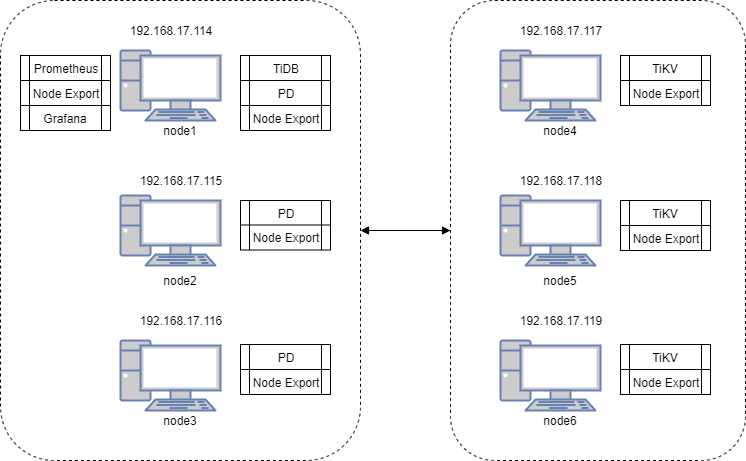

1. Penjelasan

    Terdapat 6 node yang akan dibuat menggunakan script vagrant. 6 Node masing-masing dengan ip dan nama telah terdapat pada gambar. Box pada gambar merupakan aplikasi yang akan diinstall pada node tersebut.

    Spesifikasi virtual machine dapat dilihat pada tabel berikut:

    | Nama | OS |  RAM | IP |
    | -------------- | ------------ | ------- | -------------- |
    | node1  | centOs7 | 1024 MB | 192.168.17.114 |
    | node2  | centOs7 | 1024 MB | 192.168.17.115 |
    | node3  | centOs7 | 1024 MB | 192.168.17.116 |
    | node4  | centOs7 | 1024 MB | 192.168.17.117 |
    | node5  | centOs7 | 1024 MB | 192.168.17.118 |
    | node6  | centOs7 | 1024 MB | 192.168.17.119 |

# Instalasi Node

## Requirement
    
  Berikut merupakan aplikasi yang harus dipersiapkan dalam melakukan installasi 6 node.

  1. Vagrant
  2. Plugin vagrant-vbguest. (``vagrant plugin install vagrant-vbguest``).
  3. Ram 8GB (Minimal)

## Vagrant File

  1. Buat ``Vagrantfile`` pada direktori anda dengan menjalankan perintah
      ```bash
      vagrant init
      ```

  2. Ubah isi ``Vagrantfile`` menjadi sebagai berikut
      ```ruby
      # -*- mode: ruby -*-
      # vi: set ft=ruby :

      Vagrant.configure("2") do |config|
        (1..6).each do |i|
          ip = i + 113
          config.vm.define "node#{i}" do |node|
            node.vm.hostname = "node#{i}"

            # Gunakan CentOS 7 dari geerlingguy yang sudah dilengkapi VirtualBox Guest Addition
            node.vm.box = "geerlingguy/centos7"
            node.vm.box_version = "1.2.19"
            
            # Disable checking VirtualBox Guest Addition agar tidak compile ulang setiap restart
            node.vbguest.auto_update = false
            
            node.vm.network "private_network", ip: "192.168.17.#{ip}"
            
            node.vm.provider "virtualbox" do |vb|
              vb.name = "node#{i}"
              vb.gui = false
              vb.memory = "1024"
            end
      
            node.vm.provision "shell", path: "provision/bootstrap.sh", privileged: false
          end
        end
      end
      ```

## Provision Script
  Vagrantfile memerlukan file ``bootstrap.sh`` pada provisioning virtual machine. Buat folder ``provision`` dan buat file ``bootstrap.sh`` pada folder tersebut.
  Ubah isi file ``bootstrap.sh`` menjadi sebagai berikut:
  ```sh
  # Referensi:
  # https://pingcap.com/docs/stable/how-to/deploy/from-tarball/testing-environment/

  # Update the repositories
  # sudo yum update -y

  # Copy open files limit configuration
  sudo cp /vagrant/config/tidb.conf /etc/security/limits.d/

  # Enable max open file
  sudo sysctl -w fs.file-max=1000000

  # Copy atau download TiDB binary dari http://download.pingcap.org/tidb-v3.0-linux-amd64.tar.gz
  cp /vagrant/installer/tidb-v3.0-linux-amd64.tar.gz .

  # Extract TiDB binary
  tar -xzf tidb-v3.0-linux-amd64.tar.gz && mv tidb-v3.0-linux-amd64 tidb

  # Install MariaDB to get MySQL client, Git, and Nano.
  sudo yum -y install mariadb git nano

  # Download and Extract Node Exporter
  cp /vagrant/installer/node_exporter-0.18.1.linux-amd64.tar.gz .
  tar -xzf node_exporter-0.18.1.linux-amd64.tar.gz
  ```

## File lainnya
  Pada ``bootstrap.sh`` diperlukan 2 file external yaitu file tidb ``tidb-v3.0-linux-amd64.tar.gz`` dan ``node_exporter-0.18.1.linux-amd64.tar.gz``. Download kedua file tersebut melalui tautan berikut:
  1. [tidb-v3.0-linux-amd64.tar.gz](http://download.pingcap.org/tidb-v3.0-linux-amd64.tar.gz)
  2. [node_exporter-0.18.1.linux-amd64.tar.gz](https://github.com/prometheus/node_exporter/releases/download/v0.18.1/node_exporter-0.18.1.linux-amd64.tar.gz)
   
  Letakkan kedua file tersebut pada direktori ``installer``.

## Eksekusi

  Jalankan vagrant dengan menggunakan perintah
  ```bash
  vagrant up
  ```
  Tunggu hingga semua virtual machine berhasil dibuat.

## Konfigurasi TiDB

### node1
  Masuk kedalam virtual machine dengan menggunakan perintah
  ```bash
  vagrant ssh node1
  ```
  Pastikan pada virtual machine sudah terdapat folder bernama ``tidb``.
  Kemudian jalankan perintah berikut:
  ```bash
  cd tidb
  ./bin/pd-server --name=pd1 \
                --data-dir=pd \
                --client-urls="http://192.168.17.114:2379" \
                --peer-urls="http://192.168.17.114:2380" \
                --initial-cluster="pd1=http://192.168.17.114:2380,pd2=http://192.168.17.115:2380,pd3=http://192.168.17.116:2380" \
                --log-file=pd.log &
  ```

  Setelah selesai menjalankan PD dan TiKV pada semua node, kembali ke node1 dan jalankan perintah berikut:
  ```bash
  cd tidb
  ./bin/tidb-server --store=tikv \
                  --path="192.168.17.114:2379" \
                  --log-file=tidb.log &
  ```

### node2
  Masuk kedalam virtual machine dengan menggunakan perintah
  ```bash
  vagrant ssh node2
  ```
  Pastikan pada virtual machine sudah terdapat folder bernama ``tidb``.
  Kemudian jalankan perintah berikut:
  ```bash
  cd tidb
  ./bin/pd-server --name=pd2 \
                --data-dir=pd \
                --client-urls="http://192.168.17.115:2379" \
                --peer-urls="http://192.168.17.115:2380" \
                --initial-cluster="pd1=http://192.168.17.114:2380,pd2=http://192.168.17.115:2380,pd3=http://192.168.17.116:2380" \
                --log-file=pd.log &
  ```
### node3
  Masuk kedalam virtual machine dengan menggunakan perintah
  ```bash
  vagrant ssh node3
  ```
  Pastikan pada virtual machine sudah terdapat folder bernama ``tidb``.
  Kemudian jalankan perintah berikut:
  ```bash
  cd tidb
  ./bin/pd-server --name=pd3 \
                --data-dir=pd \
                --client-urls="http://192.168.17.116:2379" \
                --peer-urls="http://192.168.17.116:2380" \
                --initial-cluster="pd1=http://192.168.17.114:2380,pd2=http://192.168.17.115:2380,pd3=http://192.168.17.116:2380" \
                --log-file=pd.log &
  ```
### node4
  Masuk kedalam virtual machine dengan menggunakan perintah
  ```bash
  vagrant ssh node4
  ```
  Pastikan pada virtual machine sudah terdapat folder bernama ``tidb``.
  Kemudian jalankan perintah berikut:
  ```bash
  cd tidb
  ./bin/tikv-server --pd="192.168.17.114:2379,192.168.17.115:2379,192.168.17.116:2379" \
                  --addr="192.168.17.117:20160" \
                  --data-dir=tikv \
                  --log-file=tikv.log &
  ```
### node5
  Masuk kedalam virtual machine dengan menggunakan perintah
  ```bash
  vagrant ssh node5
  ```
  Pastikan pada virtual machine sudah terdapat folder bernama ``tidb``.
  Kemudian jalankan perintah berikut:
  ```bash
  cd tidb
./bin/tikv-server --pd="192.168.17.114:2379,192.168.17.115:2379,192.168.17.116:2379" \
                  --addr="192.168.17.118:20160" \
                  --data-dir=tikv \
                  --log-file=tikv.log &
  ```
### node6
  Masuk kedalam virtual machine dengan menggunakan perintah
  ```bash
  vagrant ssh node6
  ```
  Pastikan pada virtual machine sudah terdapat folder bernama ``tidb``.
  Kemudian jalankan perintah berikut:
  ```bash
  cd tidb
  ./bin/tikv-server --pd="192.168.17.114:2379,192.168.17.115:2379,192.168.17.116:2379" \
                    --addr="192.168.17.119:20160" \
                    --data-dir=tikv \
                    --log-file=tikv.log &
  ``` 

# Instalasi Monitoring Dashboard

## Prometheus
Install node_exporter pada setiap node.

Jalankan perintah berikut pada masing - masing node.
```bash
./node_exporter --web.listen-address=":9100" \
    --log.level="info" &
```
Masuk ke node1 dan jalankan perintah berikut:
```bash
wget https://github.com/prometheus/prometheus/releases/download/v2.2.1/prometheus-2.2.1.linux-amd64.tar.gz
tar -xzf prometheus-2.2.1.linux-amd64.tar.gz


cd prometheus-2.2.1.linux-amd64
cp /vagrant/config/prometheus.yml .
./prometheus \
    --config.file="./prometheus.yml" \
    --web.listen-address=":9090" \
    --web.external-url="http://192.168.17.114:9090/" \
    --web.enable-admin-api \
    --log.level="info" \
    --storage.tsdb.path="./data.metrics" \
    --storage.tsdb.retention="15d" &
```

## Grafana
Masuk ke node1 dan jalankan perintah berikut:
```bash
wget https://dl.grafana.com/oss/release/grafana-6.5.1.linux-amd64.tar.gz
tar -zxf grafana-6.5.1.linux-amd64.tar.gz
cd grafana-6.5.1
cp /vagrant/config/grafana.ini conf/
./bin/grafana-server \
    --config="./conf/grafana.ini" &
```

## Konfigurasi Dashboard
Setelah berhasil menjalankan ``prometheus`` dan ``grafana`` buka ``192.168.17.114:3000`` dan login dengan menggunakan username=``admin``password=``admin``

Tambahkan data source dengan cara menekan logo grafana, lalu Add Data source, dan tuliskan sesuai dengan prometheus.

## Dashboard JSON.

Klik logo grafana, menuju dashboard dan klik import dashboard. Dashboard yang dapat di import bisa dilihat pada repository [berikut](https://github.com/pingcap/tidb-ansible/tree/master/scripts).

### Hasil Dashboard

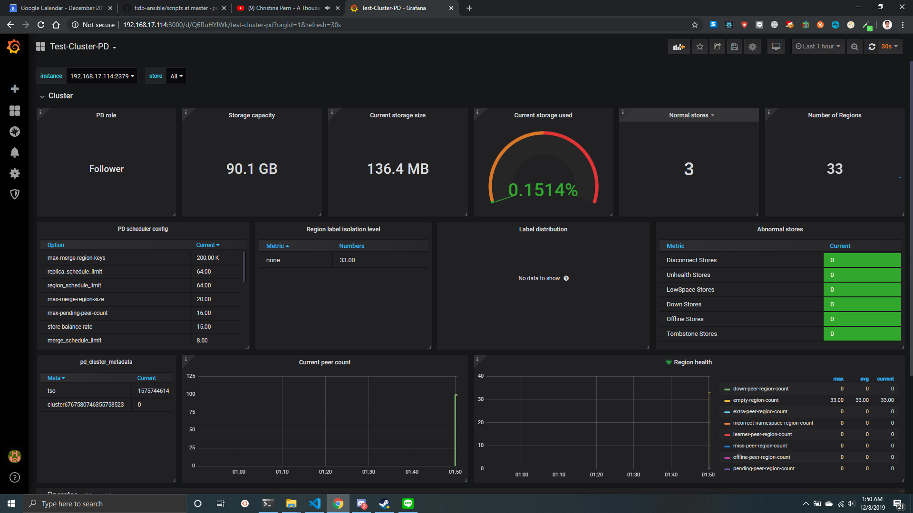

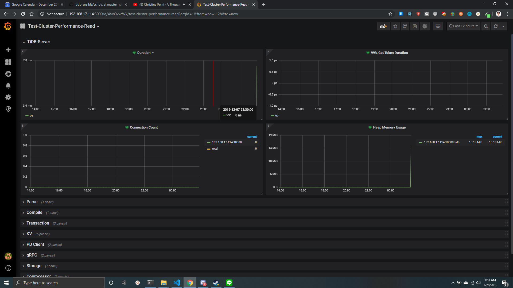

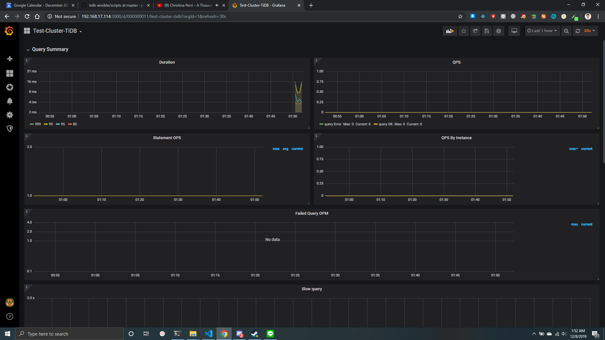

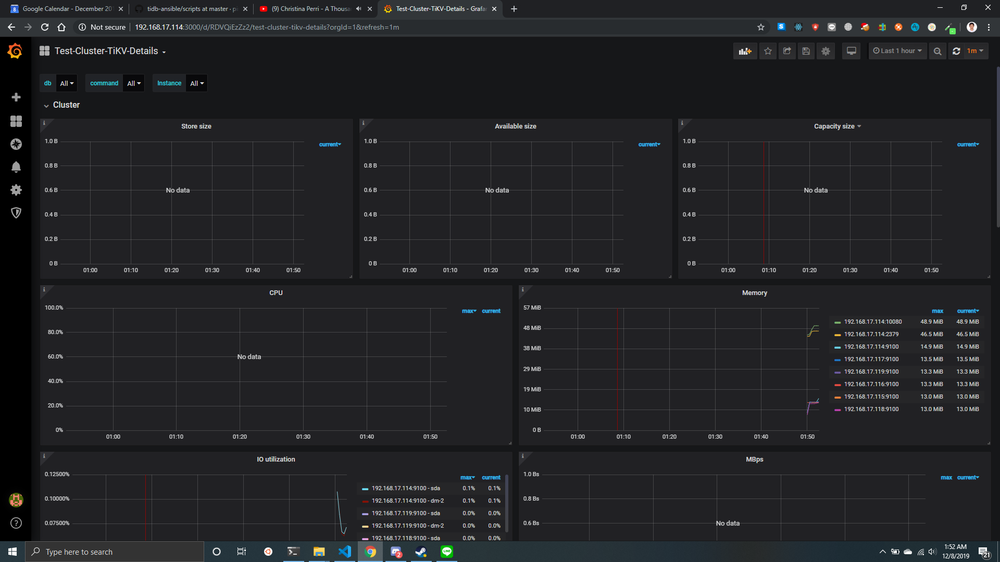

# Aplikasi Web

## Wordpress
Aplikasi yang digunakan adalah aplikasi CMS Wordpress. Wordpress dapat diunduh pada https://wordpress.org/download/.
- Install aplikasi wordpress beserta lamp/xampp.
- Masuk pada node1 dan jalankan perintah berikut:
  ```sh
  mysql -h 127.0.0.1 -P 4000 -u root
  CREATE DATABASE wordpress DEFAULT CHARACTER SET utf8 COLLATE utf8_unicode_ci;
  CREATE USER 'wordpress'@'%' IDENTIFIED BY 'wordpress';
  GRANT ALL ON wordpress.* TO 'wordpress'@'%' WITH GRANT OPTION;
  FLUSH PRIVILEGES;
  exit
  ```
- Kemudian buka aplikasi wordpress anda untuk konfigurasi awal. Untuk setting database gunakan username=``wordpress`` dan password=``wordpress`` dengan host ``192.168.17.114:4000``

## CRUD
Uji coba melakukan CRUD pada database melalui aplikasi.

### Create
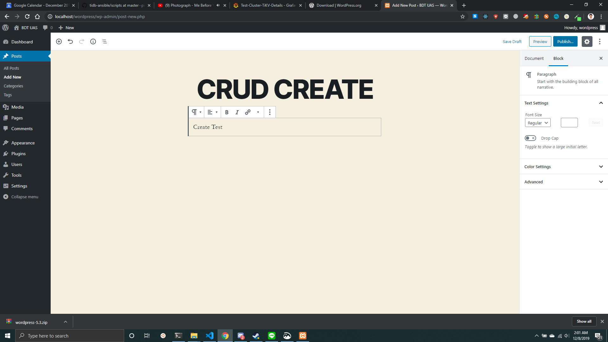

### Read


### Update


### Delete
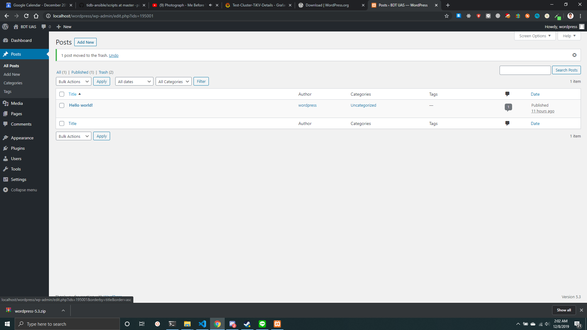

# Uji performa

## Apache J Meter

### 100 Koneksi
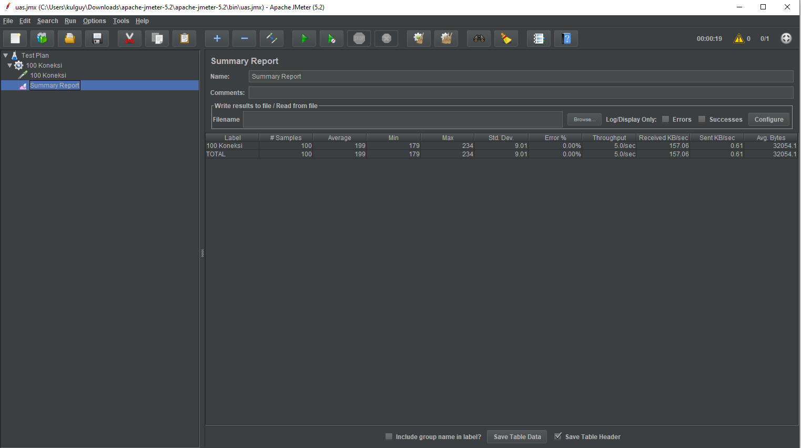

### 500 Koneksi
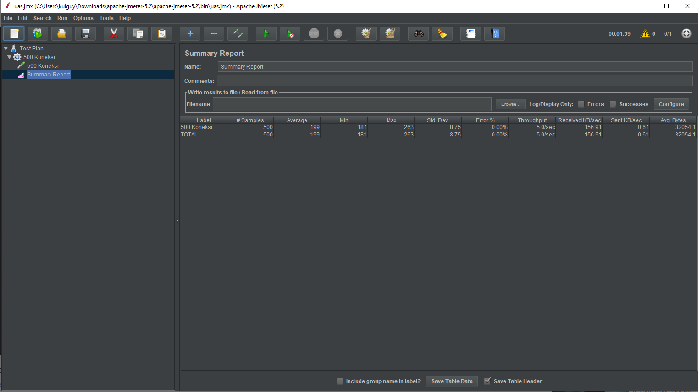

### 1000 Koneksi
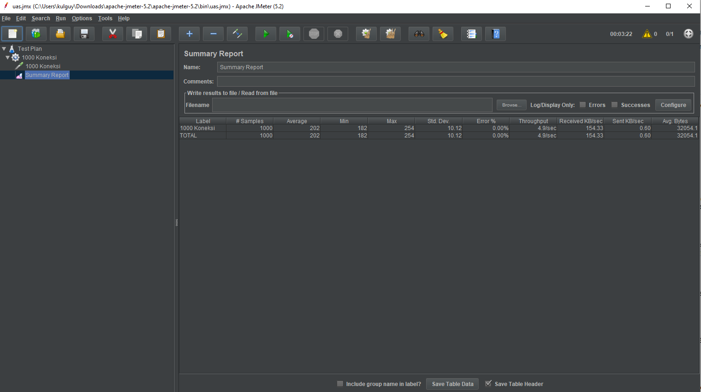

## Sysbench

### Installasi
Masuk ke node1 dengan menggunakan ``vagrant ssh node1``. Kemudian jalankan perintah berikut:
```bash
curl -s https://packagecloud.io/install/repositories/akopytov/sysbench/script.rpm.sh | sudo bash
sudo yum -y install sysbench

git clone https://github.com/pingcap/tidb-bench.git
cd tidb-bench/sysbench
```

### Langkah pengujian
- Ubah file ``config`` dengan host sesuai dengan node1 yaitu ``192.168.17.114`` dengan port ``4000``.
- Buat database ``sbtest`` pada tidb node1.
- Jalankan command persiapan ``./run.sh point_select prepare 100``
- Jalankan sysbench ``./run.sh point_select run 100``

### 1 PD Server
Hasil ujicoba sysbench dengan hanya terdapat 1 PD server pada cluster.
Hasil ujicoba sysbench dengan hanya terdapat 2 PD server pada cluster.
Menghapus salah satu PD dalam cluster dapat dilakukan dengan cara berikut.
```bash
cd ~
cd tidb
cd bin
./pd-ctl -u http://192.168.17.114:2379 -i
member delete name pd3
member delete name pd2
```

Perintah akan mereturn ``Success`` apabila pd3 dan pd2 berhasil dihilangkan dari cluster.
Hasil Sysbench
```log
sysbench 1.0.18 (using bundled LuaJIT 2.1.0-beta2)

Running the test with following options:
Number of threads: 100
Report intermediate results every 10 second(s)
Initializing random number generator from current time


Initializing worker threads...

Threads started!

[ 10s ] thds: 100 tps: 12989.61 qps: 12989.61 (r/w/o: 12989.61/0.00/0.00) lat (ms,95%): 15.55 err/s: 0.00 reconn/s: 0.00
[ 20s ] thds: 100 tps: 12171.97 qps: 12171.97 (r/w/o: 12171.97/0.00/0.00) lat (ms,95%): 16.41 err/s: 0.00 reconn/s: 0.00
[ 30s ] thds: 100 tps: 13994.71 qps: 13994.71 (r/w/o: 13994.71/0.00/0.00) lat (ms,95%): 13.95 err/s: 0.00 reconn/s: 0.00
[ 40s ] thds: 100 tps: 14408.94 qps: 14408.94 (r/w/o: 14408.94/0.00/0.00) lat (ms,95%): 13.70 err/s: 0.00 reconn/s: 0.00
[ 50s ] thds: 100 tps: 13973.31 qps: 13973.31 (r/w/o: 13973.31/0.00/0.00) lat (ms,95%): 14.21 err/s: 0.00 reconn/s: 0.00
[ 60s ] thds: 100 tps: 13958.93 qps: 13958.93 (r/w/o: 13958.93/0.00/0.00) lat (ms,95%): 13.70 err/s: 0.00 reconn/s: 0.00
[ 70s ] thds: 100 tps: 12933.94 qps: 12933.94 (r/w/o: 12933.94/0.00/0.00) lat (ms,95%): 15.27 err/s: 0.00 reconn/s: 0.00
[ 80s ] thds: 100 tps: 14539.36 qps: 14539.36 (r/w/o: 14539.36/0.00/0.00) lat (ms,95%): 13.22 err/s: 0.00 reconn/s: 0.00
[ 90s ] thds: 100 tps: 14737.70 qps: 14737.70 (r/w/o: 14737.70/0.00/0.00) lat (ms,95%): 12.75 err/s: 0.00 reconn/s: 0.00
[ 100s ] thds: 100 tps: 14740.77 qps: 14740.77 (r/w/o: 14740.77/0.00/0.00) lat (ms,95%): 13.46 err/s: 0.00 reconn/s: 0.00
[ 110s ] thds: 100 tps: 14509.18 qps: 14509.18 (r/w/o: 14509.18/0.00/0.00) lat (ms,95%): 13.70 err/s: 0.00 reconn/s: 0.00
[ 120s ] thds: 100 tps: 14951.83 qps: 14951.83 (r/w/o: 14951.83/0.00/0.00) lat (ms,95%): 13.22 err/s: 0.00 reconn/s: 0.00
[ 130s ] thds: 100 tps: 14850.42 qps: 14850.42 (r/w/o: 14850.42/0.00/0.00) lat (ms,95%): 13.46 err/s: 0.00 reconn/s: 0.00
[ 140s ] thds: 100 tps: 14620.83 qps: 14620.83 (r/w/o: 14620.83/0.00/0.00) lat (ms,95%): 13.70 err/s: 0.00 reconn/s: 0.00
[ 150s ] thds: 100 tps: 14695.65 qps: 14695.65 (r/w/o: 14695.65/0.00/0.00) lat (ms,95%): 13.70 err/s: 0.00 reconn/s: 0.00
[ 160s ] thds: 100 tps: 15048.83 qps: 15048.83 (r/w/o: 15048.83/0.00/0.00) lat (ms,95%): 13.22 err/s: 0.00 reconn/s: 0.00
[ 170s ] thds: 100 tps: 14782.57 qps: 14782.57 (r/w/o: 14782.57/0.00/0.00) lat (ms,95%): 13.46 err/s: 0.00 reconn/s: 0.00
[ 180s ] thds: 100 tps: 14892.58 qps: 14892.58 (r/w/o: 14892.58/0.00/0.00) lat (ms,95%): 12.75 err/s: 0.00 reconn/s: 0.00
[ 190s ] thds: 100 tps: 15002.94 qps: 15002.94 (r/w/o: 15002.94/0.00/0.00) lat (ms,95%): 13.46 err/s: 0.00 reconn/s: 0.00
[ 200s ] thds: 100 tps: 14788.32 qps: 14788.32 (r/w/o: 14788.32/0.00/0.00) lat (ms,95%): 13.46 err/s: 0.00 reconn/s: 0.00
[ 210s ] thds: 100 tps: 14778.76 qps: 14778.76 (r/w/o: 14778.76/0.00/0.00) lat (ms,95%): 13.46 err/s: 0.00 reconn/s: 0.00
[ 220s ] thds: 100 tps: 15078.10 qps: 15078.10 (r/w/o: 15078.10/0.00/0.00) lat (ms,95%): 13.22 err/s: 0.00 reconn/s: 0.00
[ 230s ] thds: 100 tps: 14927.76 qps: 14927.76 (r/w/o: 14927.76/0.00/0.00) lat (ms,95%): 13.22 err/s: 0.00 reconn/s: 0.00
[ 240s ] thds: 100 tps: 14741.46 qps: 14741.46 (r/w/o: 14741.46/0.00/0.00) lat (ms,95%): 13.46 err/s: 0.00 reconn/s: 0.00
[ 250s ] thds: 100 tps: 14919.29 qps: 14919.29 (r/w/o: 14919.29/0.00/0.00) lat (ms,95%): 13.46 err/s: 0.00 reconn/s: 0.00
[ 260s ] thds: 100 tps: 14849.69 qps: 14849.69 (r/w/o: 14849.69/0.00/0.00) lat (ms,95%): 12.98 err/s: 0.00 reconn/s: 0.00
[ 270s ] thds: 100 tps: 14454.60 qps: 14454.60 (r/w/o: 14454.60/0.00/0.00) lat (ms,95%): 13.95 err/s: 0.00 reconn/s: 0.00
[ 280s ] thds: 100 tps: 11906.42 qps: 11906.42 (r/w/o: 11906.42/0.00/0.00) lat (ms,95%): 17.32 err/s: 0.00 reconn/s: 0.00
[ 290s ] thds: 100 tps: 11289.38 qps: 11289.38 (r/w/o: 11289.38/0.00/0.00) lat (ms,95%): 17.95 err/s: 0.00 reconn/s: 0.00
[ 300s ] thds: 100 tps: 13267.96 qps: 13267.96 (r/w/o: 13267.96/0.00/0.00) lat (ms,95%): 15.00 err/s: 0.00 reconn/s: 0.00
SQL statistics:
    queries performed:
        read:                            4268186
        write:                           0
        other:                           0
        total:                           4268186
    transactions:                        4268186 (14226.00 per sec.)
    queries:                             4268186 (14226.00 per sec.)
    ignored errors:                      0      (0.00 per sec.)
    reconnects:                          0      (0.00 per sec.)

General statistics:
    total time:                          300.0259s
    total number of events:              4268186

Latency (ms):
         min:                                    0.33
         avg:                                    7.03
         max:                                   62.96
         95th percentile:                       13.95
         sum:                             29995325.96

Threads fairness:
    events (avg/stddev):           42681.8600/102.09
    execution time (avg/stddev):   299.9533/0.02

```

### 2 PD Server
Hasil ujicoba sysbench dengan hanya terdapat 2 PD server pada cluster.
Menghapus salah satu PD dalam cluster dapat dilakukan dengan cara berikut.
```bash
cd ~
cd tidb
cd bin
./pd-ctl -u http://192.168.17.114:2379 -i
member delete name pd3
```

Perintah akan mereturn ``Success`` apabila pd3 berhasil dihilangkan dari cluster.
Hasil Sysbench
```log
sysbench 1.0.18 (using bundled LuaJIT 2.1.0-beta2)

Running the test with following options:
Number of threads: 100
Report intermediate results every 10 second(s)
Initializing random number generator from current time


Initializing worker threads...

Threads started!

[ 10s ] thds: 100 tps: 14918.82 qps: 14918.82 (r/w/o: 14918.82/0.00/0.00) lat (ms,95%): 13.70 err/s: 0.00 reconn/s: 0.00
[ 20s ] thds: 100 tps: 15190.14 qps: 15190.14 (r/w/o: 15190.14/0.00/0.00) lat (ms,95%): 12.98 err/s: 0.00 reconn/s: 0.00
[ 30s ] thds: 100 tps: 15270.08 qps: 15270.08 (r/w/o: 15270.08/0.00/0.00) lat (ms,95%): 12.98 err/s: 0.00 reconn/s: 0.00
[ 40s ] thds: 100 tps: 15412.56 qps: 15412.56 (r/w/o: 15412.56/0.00/0.00) lat (ms,95%): 12.75 err/s: 0.00 reconn/s: 0.00
[ 50s ] thds: 100 tps: 14115.87 qps: 14115.87 (r/w/o: 14115.87/0.00/0.00) lat (ms,95%): 13.70 err/s: 0.00 reconn/s: 0.00
[ 60s ] thds: 100 tps: 14965.42 qps: 14965.42 (r/w/o: 14965.42/0.00/0.00) lat (ms,95%): 12.75 err/s: 0.00 reconn/s: 0.00
[ 70s ] thds: 100 tps: 14701.71 qps: 14701.71 (r/w/o: 14701.71/0.00/0.00) lat (ms,95%): 13.46 err/s: 0.00 reconn/s: 0.00
[ 80s ] thds: 100 tps: 15115.28 qps: 15115.28 (r/w/o: 15115.28/0.00/0.00) lat (ms,95%): 13.22 err/s: 0.00 reconn/s: 0.00
[ 90s ] thds: 100 tps: 15104.65 qps: 15104.65 (r/w/o: 15104.65/0.00/0.00) lat (ms,95%): 12.75 err/s: 0.00 reconn/s: 0.00
[ 100s ] thds: 100 tps: 15071.57 qps: 15071.57 (r/w/o: 15071.57/0.00/0.00) lat (ms,95%): 13.22 err/s: 0.00 reconn/s: 0.00
[ 110s ] thds: 100 tps: 15251.69 qps: 15251.79 (r/w/o: 15251.79/0.00/0.00) lat (ms,95%): 13.22 err/s: 0.00 reconn/s: 0.00
[ 120s ] thds: 100 tps: 14732.89 qps: 14732.79 (r/w/o: 14732.79/0.00/0.00) lat (ms,95%): 13.46 err/s: 0.00 reconn/s: 0.00
[ 130s ] thds: 100 tps: 14847.44 qps: 14847.44 (r/w/o: 14847.44/0.00/0.00) lat (ms,95%): 13.22 err/s: 0.00 reconn/s: 0.00
[ 140s ] thds: 100 tps: 15096.77 qps: 15096.77 (r/w/o: 15096.77/0.00/0.00) lat (ms,95%): 12.75 err/s: 0.00 reconn/s: 0.00
[ 150s ] thds: 100 tps: 14840.87 qps: 14840.87 (r/w/o: 14840.87/0.00/0.00) lat (ms,95%): 13.22 err/s: 0.00 reconn/s: 0.00
[ 160s ] thds: 100 tps: 15097.87 qps: 15097.87 (r/w/o: 15097.87/0.00/0.00) lat (ms,95%): 12.98 err/s: 0.00 reconn/s: 0.00
[ 170s ] thds: 100 tps: 14953.31 qps: 14953.31 (r/w/o: 14953.31/0.00/0.00) lat (ms,95%): 13.22 err/s: 0.00 reconn/s: 0.00
[ 180s ] thds: 100 tps: 14850.87 qps: 14850.87 (r/w/o: 14850.87/0.00/0.00) lat (ms,95%): 13.70 err/s: 0.00 reconn/s: 0.00
[ 190s ] thds: 100 tps: 15040.85 qps: 15040.85 (r/w/o: 15040.85/0.00/0.00) lat (ms,95%): 13.22 err/s: 0.00 reconn/s: 0.00
[ 200s ] thds: 100 tps: 14896.14 qps: 14896.14 (r/w/o: 14896.14/0.00/0.00) lat (ms,95%): 13.46 err/s: 0.00 reconn/s: 0.00
[ 210s ] thds: 100 tps: 14534.78 qps: 14534.78 (r/w/o: 14534.78/0.00/0.00) lat (ms,95%): 13.95 err/s: 0.00 reconn/s: 0.00
[ 220s ] thds: 100 tps: 14827.09 qps: 14827.09 (r/w/o: 14827.09/0.00/0.00) lat (ms,95%): 13.46 err/s: 0.00 reconn/s: 0.00
[ 230s ] thds: 100 tps: 14902.41 qps: 14902.41 (r/w/o: 14902.41/0.00/0.00) lat (ms,95%): 13.70 err/s: 0.00 reconn/s: 0.00
[ 240s ] thds: 100 tps: 14630.70 qps: 14630.70 (r/w/o: 14630.70/0.00/0.00) lat (ms,95%): 13.70 err/s: 0.00 reconn/s: 0.00
[ 250s ] thds: 100 tps: 14769.96 qps: 14769.96 (r/w/o: 14769.96/0.00/0.00) lat (ms,95%): 12.98 err/s: 0.00 reconn/s: 0.00
[ 260s ] thds: 100 tps: 14563.04 qps: 14563.04 (r/w/o: 14563.04/0.00/0.00) lat (ms,95%): 13.46 err/s: 0.00 reconn/s: 0.00
[ 270s ] thds: 100 tps: 14726.77 qps: 14726.77 (r/w/o: 14726.77/0.00/0.00) lat (ms,95%): 13.95 err/s: 0.00 reconn/s: 0.00
[ 280s ] thds: 100 tps: 14809.31 qps: 14809.31 (r/w/o: 14809.31/0.00/0.00) lat (ms,95%): 13.46 err/s: 0.00 reconn/s: 0.00
[ 290s ] thds: 100 tps: 14798.92 qps: 14798.92 (r/w/o: 14798.92/0.00/0.00) lat (ms,95%): 13.22 err/s: 0.00 reconn/s: 0.00
[ 300s ] thds: 100 tps: 14771.11 qps: 14771.11 (r/w/o: 14771.11/0.00/0.00) lat (ms,95%): 12.98 err/s: 0.00 reconn/s: 0.00
SQL statistics:
    queries performed:
        read:                            4468213
        write:                           0
        other:                           0
        total:                           4468213
    transactions:                        4468213 (14892.86 per sec.)
    queries:                             4468213 (14892.86 per sec.)
    ignored errors:                      0      (0.00 per sec.)
    reconnects:                          0      (0.00 per sec.)

General statistics:
    total time:                          300.0228s
    total number of events:              4468213

Latency (ms):
         min:                                    0.34
         avg:                                    6.71
         max:                                   86.79
         95th percentile:                       13.22
         sum:                             29995111.74

Threads fairness:
    events (avg/stddev):           44682.1300/111.02
    execution time (avg/stddev):   299.9511/0.01

```

### 3 PD Server
Hasil ujicoba sysbench dengan hanya terdapat 3 PD server pada cluster.

```log
sysbench 1.0.18 (using bundled LuaJIT 2.1.0-beta2)

Running the test with following options:
Number of threads: 100
Report intermediate results every 10 second(s)
Initializing random number generator from current time


Initializing worker threads...

Threads started!

[ 10s ] thds: 100 tps: 15052.79 qps: 15052.79 (r/w/o: 15052.79/0.00/0.00) lat (ms,95%): 13.70 err/s: 0.00 reconn/s: 0.00
[ 20s ] thds: 100 tps: 15271.12 qps: 15271.12 (r/w/o: 15271.12/0.00/0.00) lat (ms,95%): 13.22 err/s: 0.00 reconn/s: 0.00
[ 30s ] thds: 100 tps: 15101.25 qps: 15101.25 (r/w/o: 15101.25/0.00/0.00) lat (ms,95%): 12.98 err/s: 0.00 reconn/s: 0.00
[ 40s ] thds: 100 tps: 15246.29 qps: 15246.29 (r/w/o: 15246.29/0.00/0.00) lat (ms,95%): 12.98 err/s: 0.00 reconn/s: 0.00
[ 50s ] thds: 100 tps: 14748.24 qps: 14748.24 (r/w/o: 14748.24/0.00/0.00) lat (ms,95%): 13.70 err/s: 0.00 reconn/s: 0.00
[ 60s ] thds: 100 tps: 14898.85 qps: 14898.85 (r/w/o: 14898.85/0.00/0.00) lat (ms,95%): 13.22 err/s: 0.00 reconn/s: 0.00
[ 70s ] thds: 100 tps: 14892.49 qps: 14892.49 (r/w/o: 14892.49/0.00/0.00) lat (ms,95%): 13.22 err/s: 0.00 reconn/s: 0.00
[ 80s ] thds: 100 tps: 14957.30 qps: 14957.30 (r/w/o: 14957.30/0.00/0.00) lat (ms,95%): 13.22 err/s: 0.00 reconn/s: 0.00
[ 90s ] thds: 100 tps: 14802.14 qps: 14802.14 (r/w/o: 14802.14/0.00/0.00) lat (ms,95%): 13.46 err/s: 0.00 reconn/s: 0.00
[ 100s ] thds: 100 tps: 15058.77 qps: 15058.77 (r/w/o: 15058.77/0.00/0.00) lat (ms,95%): 12.98 err/s: 0.00 reconn/s: 0.00
[ 110s ] thds: 100 tps: 15105.04 qps: 15105.04 (r/w/o: 15105.04/0.00/0.00) lat (ms,95%): 12.75 err/s: 0.00 reconn/s: 0.00
[ 120s ] thds: 100 tps: 14874.44 qps: 14874.44 (r/w/o: 14874.44/0.00/0.00) lat (ms,95%): 13.22 err/s: 0.00 reconn/s: 0.00
[ 130s ] thds: 100 tps: 14948.83 qps: 14948.83 (r/w/o: 14948.83/0.00/0.00) lat (ms,95%): 13.22 err/s: 0.00 reconn/s: 0.00
[ 140s ] thds: 100 tps: 14947.05 qps: 14947.05 (r/w/o: 14947.05/0.00/0.00) lat (ms,95%): 13.46 err/s: 0.00 reconn/s: 0.00
[ 150s ] thds: 100 tps: 14970.61 qps: 14970.61 (r/w/o: 14970.61/0.00/0.00) lat (ms,95%): 13.22 err/s: 0.00 reconn/s: 0.00
[ 160s ] thds: 100 tps: 14682.62 qps: 14682.62 (r/w/o: 14682.62/0.00/0.00) lat (ms,95%): 13.46 err/s: 0.00 reconn/s: 0.00
[ 170s ] thds: 100 tps: 14520.54 qps: 14520.54 (r/w/o: 14520.54/0.00/0.00) lat (ms,95%): 13.70 err/s: 0.00 reconn/s: 0.00
[ 180s ] thds: 100 tps: 15047.25 qps: 15047.25 (r/w/o: 15047.25/0.00/0.00) lat (ms,95%): 13.22 err/s: 0.00 reconn/s: 0.00
[ 190s ] thds: 100 tps: 15035.07 qps: 15035.07 (r/w/o: 15035.07/0.00/0.00) lat (ms,95%): 12.98 err/s: 0.00 reconn/s: 0.00
[ 200s ] thds: 100 tps: 15049.04 qps: 15049.04 (r/w/o: 15049.04/0.00/0.00) lat (ms,95%): 12.98 err/s: 0.00 reconn/s: 0.00
[ 210s ] thds: 100 tps: 14943.56 qps: 14943.56 (r/w/o: 14943.56/0.00/0.00) lat (ms,95%): 12.98 err/s: 0.00 reconn/s: 0.00
[ 220s ] thds: 100 tps: 15020.89 qps: 15020.89 (r/w/o: 15020.89/0.00/0.00) lat (ms,95%): 12.98 err/s: 0.00 reconn/s: 0.00
[ 230s ] thds: 100 tps: 14836.80 qps: 14836.80 (r/w/o: 14836.80/0.00/0.00) lat (ms,95%): 13.22 err/s: 0.00 reconn/s: 0.00
[ 240s ] thds: 100 tps: 14876.25 qps: 14876.25 (r/w/o: 14876.25/0.00/0.00) lat (ms,95%): 12.98 err/s: 0.00 reconn/s: 0.00
[ 250s ] thds: 100 tps: 14795.34 qps: 14795.34 (r/w/o: 14795.34/0.00/0.00) lat (ms,95%): 13.22 err/s: 0.00 reconn/s: 0.00
[ 260s ] thds: 100 tps: 14901.02 qps: 14901.02 (r/w/o: 14901.02/0.00/0.00) lat (ms,95%): 12.98 err/s: 0.00 reconn/s: 0.00
[ 270s ] thds: 100 tps: 14863.45 qps: 14863.45 (r/w/o: 14863.45/0.00/0.00) lat (ms,95%): 13.22 err/s: 0.00 reconn/s: 0.00
[ 280s ] thds: 100 tps: 14759.06 qps: 14759.06 (r/w/o: 14759.06/0.00/0.00) lat (ms,95%): 13.46 err/s: 0.00 reconn/s: 0.00
[ 290s ] thds: 100 tps: 14858.54 qps: 14858.54 (r/w/o: 14858.54/0.00/0.00) lat (ms,95%): 13.46 err/s: 0.00 reconn/s: 0.00
[ 300s ] thds: 100 tps: 14739.95 qps: 14739.95 (r/w/o: 14739.95/0.00/0.00) lat (ms,95%): 13.22 err/s: 0.00 reconn/s: 0.00
SQL statistics:
    queries performed:
        read:                            4478206
        write:                           0
        other:                           0
        total:                           4478206
    transactions:                        4478206 (14926.35 per sec.)
    queries:                             4478206 (14926.35 per sec.)
    ignored errors:                      0      (0.00 per sec.)
    reconnects:                          0      (0.00 per sec.)

General statistics:
    total time:                          300.0190s
    total number of events:              4478206

Latency (ms):
         min:                                    0.29
         avg:                                    6.70
         max:                                   70.09
         95th percentile:                       13.22
         sum:                             29993628.34

Threads fairness:
    events (avg/stddev):           44782.0600/122.41
    execution time (avg/stddev):   299.9363/0.02

```

### Kesimpulan

Berdasarkan uji sysbench, jumlah PD pada tidb cluster berpengaruh dalam banyaknya jumlah transaksi yang dapat dilakukan. Semakin banyak jumlah PD semakin banyak jumlah transaksi yang dilakukan.

# Uji Failover

## Kondisi Leader Cluster

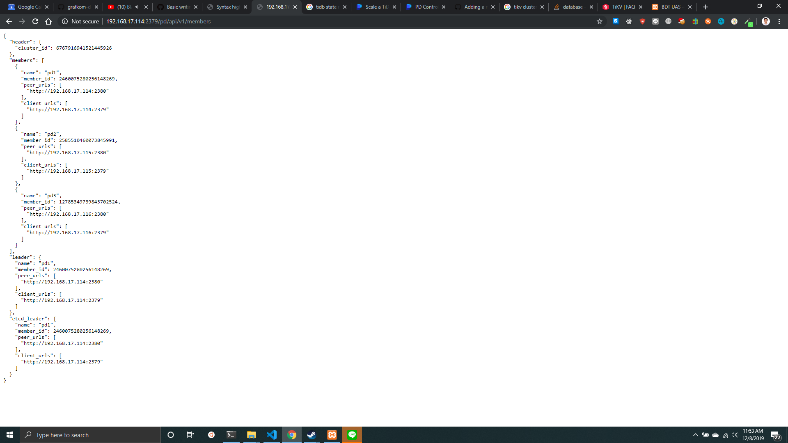

Terlihat pada gambar ``pd1`` merupakan leader dari cluster tersebut. Masuk ke node1 (tempat pd1 berada) dan matikan service PD dengan cara:
- Cari PID process pd-server dengan ``ps -aux | grep pd-server``
- Kemudian ``sudo kill -9 <pid>``

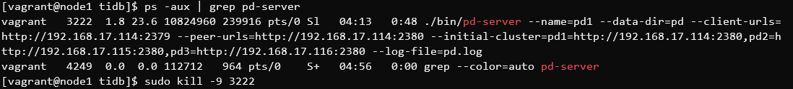

Lihat state cluster kembali dari salah satu API PD yang masih hidup.
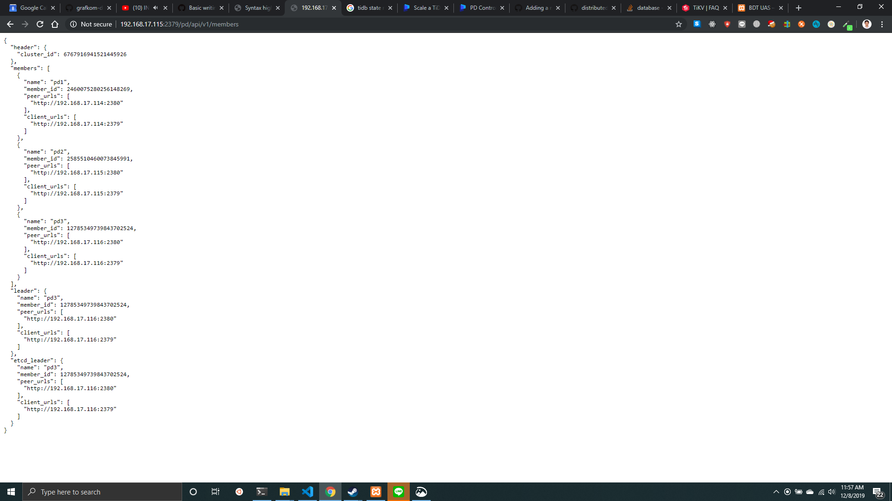

Terlihat ``PD3`` ditunjuk sebagai leader baru ketika ``PD1`` (leader sebelumnya) mati.
