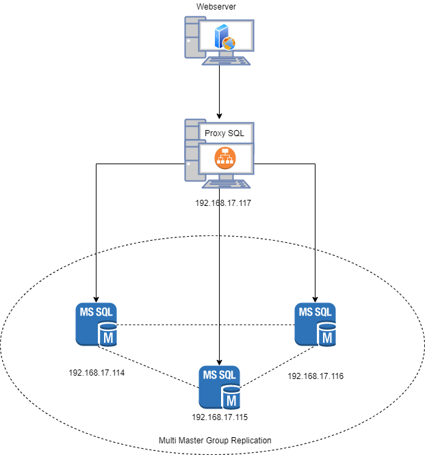
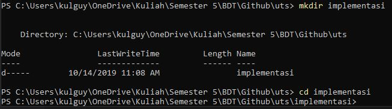
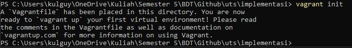
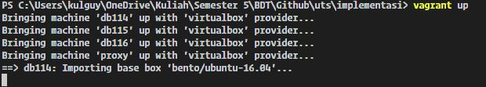

# Komang Yogananda Mahaputra Wisna - 05111740000114

## Tugas ETS Basis Data Terdistribusi <!-- omit in toc -->

- [Komang Yogananda Mahaputra Wisna - 05111740000114](#komang-yogananda-mahaputra-wisna---05111740000114)
  - [1. Desain dan implementasi infrastruktur](#1-desain-dan-implementasi-infrastruktur)
    - [A. Desain infrastruktur basis data terdistribusi + load balancing](#a-desain-infrastruktur-basis-data-terdistribusi--load-balancing)
    - [B. Implementasi infrastruktur basis data terdistribusi](#b-implementasi-infrastruktur-basis-data-terdistribusi)

## 1. Desain dan implementasi infrastruktur 

### A. Desain infrastruktur basis data terdistribusi + load balancing

Infrastruktur basis data yang digunakan adalah MySQL Group Replication dengan 3 MySQL server. Masing - masing server berperan sebagai Master (Multi Master). 3 MySQL server terkoneksi dengan sebuah Proxy SQL yang berperan sebagai load balancer. WebServer langsung terhubung dengan Proxy SQL. Aplikasi berupa aplikasi web.

Diagram Infrastrutur dapat dilihat pada gambar berikut:



**Spesifikasi Infrastruktur**
    
| Server | OS | RAM | IP |
| ------------ | ------------- | ------------ | ------------- |
| MySQL Server  | ubuntu 16.04 | 512 MB | 192.168.17.114 |
| MySQL Server  | ubuntu 16.04 | 512 MB | 192.168.17.115 |
| MySQL Server  | ubuntu 16.04 | 512 MB | 192.168.17.116 |
| Proxy SQL  | ubuntu 16.04 | 512 MB | 192.168.17.117 |
| Webserver  | ubuntu 16.04 | 512 MB | 192.168.17.118 |

### B. Implementasi infrastruktur basis data terdistribusi

**Spesifikasi Software dan Hardware yang digunakan pada dokumentasi ini:**

1. Hardware
   - Deskripsi: Laptop Dell G7 7788
   - Processor: Intel(R) Core(TM) i7-8750H CPU @ 2.20 GHz (12 CPUs)
   - Ram: 16384 MB
2. Software 
   - Sistem Operasi Windows 10 64bit
   - Vagrant 2.2.5
   - git 2.21
   - VirtualBox 6.0.12
   - PowerShell 6.2.3

**Implementasi Infrastruktur**

- Pastikan pada device telah terinstall aplikasi Vagrant dan VirtualBox. (versi disarankan sama seperti pada dokumentasi ini).

- Buat sebuah folder sebagai tempat segala konfigurasi dan jadikan folder tersebut sebagai directory aktif. Dengan menggunakan powershell pada directory aktif dapat menggunakan sintaks berikut:
  ```
    mkdir implementasi
    cd implementasi
  ```
    

- Inisialisasi vagrant file dengan menggunakan sintaks
  ```
  vagrant init
  ```
  
  Pada directory aktif anda pastikan terdapat sebuah file bernama ``Vagrantfile``.

- Modifikasi file ``Vagrantfile`` menjadi sebagai berikut:
  
  ```ruby
    # -*- mode: ruby -*-
    # vi: set ft=ruby :

    # All Vagrant configuration is done below. The "2" in Vagrant.configure
    # configures the configuration version (we support older styles for
    # backwards compatibility). Please don't change it unless you know what
    # you're doing.

    Vagrant.configure("2") do |config|
    
        # MySQL Cluster dengan 3 node
        (1..3).each do |i|
            id = 113 + i
            config.vm.define "db#{id}" do |node|
            node.vm.hostname = "db#{id}"
            node.vm.box = "bento/ubuntu-16.04"
            node.vm.network "private_network", ip: "192.168.17.#{id}"
            
            node.vm.provider "virtualbox" do |vb|
                vb.name = "db#{id}"
                vb.gui = false
                vb.memory = "512"
            end
        
            node.vm.provision "shell", path: "script#{id}.sh", privileged: false
            end
        end

        config.vm.define "proxy" do |proxy|
            proxy.vm.hostname = "proxy"
            proxy.vm.box = "bento/ubuntu-16.04"
            proxy.vm.network "private_network", ip: "192.168.17.117"
            
            proxy.vm.provider "virtualbox" do |vb|
            vb.name = "proxy"
            vb.gui = false
            vb.memory = "512"
            end

            proxy.vm.provision "shell", path: "scriptProxySQL.sh", privileged: false
        end

    end

  ```
  Penjelasan

  Melalui file tersebut vagrant akan membentuk 4 virtual box dengan masing masing menggunakan sistem operasi ubuntu 16.04 dan memiliki ram 512 MB.
  3 Virtual box akan digunakan sebagai MySQL server dan 1 akan digunakan sebagai ProxySQL server. Konfigurasi IP sesuai dengan desain infrastruktur. Masing masing server akan diberi nama sebagai berikut:

    | Server | OS | RAM | IP |
    | ------------ | ------------- | ------------ | ------------- |
    | db114  | ubuntu 16.04 | 512 MB | 192.168.17.114 |
    | db115 | ubuntu 16.04 | 512 MB | 192.168.17.115 |
    | db116  | ubuntu 16.04 | 512 MB | 192.168.17.116 |
    | proxy  | ubuntu 16.04 | 512 MB | 192.168.17.117 |

- Source list
  
  Buat file bernama ``sources.list`` berisi

  ```
    # 

    # deb cdrom:[Ubuntu-Server 16.04.4 LTS _Xenial Xerus_ - Release amd64 (20180228)]/ xenial main restricted

    #deb cdrom:[Ubuntu-Server 16.04.4 LTS _Xenial Xerus_ - Release amd64 (20180228)]/ xenial main restricted

    # See http://help.ubuntu.com/community/UpgradeNotes for how to upgrade to
    # newer versions of the distribution.
    # deb http://archive.ubuntu.com/ubuntu/ xenial main restricted
    deb http://kambing.ui.ac.id/ubuntu/ xenial main restricted
    # deb-src http://archive.ubuntu.com/ubuntu/ xenial main restricted

    ## Major bug fix updates produced after the final release of the
    ## distribution.
    # deb http://archive.ubuntu.com/ubuntu/ xenial-updates main restricted
    deb http://kambing.ui.ac.id/ubuntu/ xenial-updates main restricted
    # deb-src http://archive.ubuntu.com/ubuntu/ xenial-updates main restricted

    ## N.B. software from this repository is ENTIRELY UNSUPPORTED by the Ubuntu
    ## team. Also, please note that software in universe WILL NOT receive any
    ## review or updates from the Ubuntu security team.
    # deb http://archive.ubuntu.com/ubuntu/ xenial universe
    deb http://kambing.ui.ac.id/ubuntu/ xenial universe
    # deb-src http://archive.ubuntu.com/ubuntu/ xenial universe
    # deb http://archive.ubuntu.com/ubuntu/ xenial-updates universe
    deb http://kambing.ui.ac.id/ubuntu/ xenial-updates universe
    # deb-src http://archive.ubuntu.com/ubuntu/ xenial-updates universe

    ## N.B. software from this repository is ENTIRELY UNSUPPORTED by the Ubuntu 
    ## team, and may not be under a free licence. Please satisfy yourself as to 
    ## your rights to use the software. Also, please note that software in 
    ## multiverse WILL NOT receive any review or updates from the Ubuntu
    ## security team.
    #deb http://archive.ubuntu.com/ubuntu/ xenial multiverse
    deb http://kambing.ui.ac.id/ubuntu/ xenial multiverse
    # deb-src http://archive.ubuntu.com/ubuntu/ xenial multiverse
    #deb http://archive.ubuntu.com/ubuntu/ xenial-updates multiverse
    deb http://kambing.ui.ac.id/ubuntu/ xenial-updates multiverse
    # deb-src http://archive.ubuntu.com/ubuntu/ xenial-updates multiverse

    ## N.B. software from this repository may not have been tested as
    ## extensively as that contained in the main release, although it includes
    ## newer versions of some applications which may provide useful features.
    ## Also, please note that software in backports WILL NOT receive any review
    ## or updates from the Ubuntu security team.
    # deb http://archive.ubuntu.com/ubuntu/ xenial-backports main restricted universe multiverse
    deb http://kambing.ui.ac.id/ubuntu/ xenial-backports main restricted universe multiverse
    # deb-src http://archive.ubuntu.com/ubuntu/ xenial-backports main restricted universe multiverse

    ## Uncomment the following two lines to add software from Canonical's
    ## 'partner' repository.
    ## This software is not part of Ubuntu, but is offered by Canonical and the
    ## respective vendors as a service to Ubuntu users.
    # deb http://archive.canonical.com/ubuntu xenial partner
    # deb-src http://archive.canonical.com/ubuntu xenial partner

    # deb http://security.ubuntu.com/ubuntu xenial-security main restricted
    deb http://kambing.ui.ac.id/ubuntu/ xenial-security main restricted
    # deb-src http://security.ubuntu.com/ubuntu xenial-security main restricted
    # deb http://security.ubuntu.com/ubuntu xenial-security universe
    deb http://kambing.ui.ac.id/ubuntu/ xenial-security universe
    # deb-src http://security.ubuntu.com/ubuntu xenial-security universe
    # deb http://security.ubuntu.com/ubuntu xenial-security multiverse
    deb http://kambing.ui.ac.id/ubuntu/ xenial-security multiverse
    # deb-src http://security.ubuntu.com/ubuntu xenial-security multiverse

  ```
  Penjelasan:

    File tersebut digunakan untuk mengubah source list pada masing - masing server menjadi ``kambing.ui.ac.id``.

- File Konfigurasi MySQL
  
  **Buatlah file ``my114.cnf`` berisi sebagai berikut:**
  ```
    #
    # The MySQL database server configuration file.
    #
    # You can copy this to one of:
    # - "/etc/mysql/my.cnf" to set global options,
    # - "~/.my.cnf" to set user-specific options.
    # 
    # One can use all long options that the program supports.
    # Run program with --help to get a list of available options and with
    # --print-defaults to see which it would actually understand and use.
    #
    # For explanations see
    # http://dev.mysql.com/doc/mysql/en/server-system-variables.html

    #
    # * IMPORTANT: Additional settings that can override those from this file!
    #   The files must end with '.cnf', otherwise they'll be ignored.
    #

    !includedir /etc/mysql/conf.d/
    !includedir /etc/mysql/mysql.conf.d/

    [mysqld]

    # General replication settings
    gtid_mode = ON
    enforce_gtid_consistency = ON
    master_info_repository = TABLE
    relay_log_info_repository = TABLE
    binlog_checksum = NONE
    log_slave_updates = ON
    log_bin = binlog
    binlog_format = ROW
    transaction_write_set_extraction = XXHASH64
    loose-group_replication_bootstrap_group = OFF
    loose-group_replication_start_on_boot = ON
    loose-group_replication_ssl_mode = REQUIRED
    loose-group_replication_recovery_use_ssl = 1

    # Shared replication group configuration
    loose-group_replication_group_name = "908c7c22-ee42-11e9-81b4-2a2ae2dbcce4"
    loose-group_replication_ip_whitelist = "192.168.17.114, 192.168.17.115, 192.168.17.116"
    loose-group_replication_group_seeds = "192.168.17.114:33061, 192.168.17.115:33061, 192.168.17.116:33061"

    # Single or Multi-primary mode? Uncomment these two lines
    # for multi-primary mode, where any host can accept writes
    loose-group_replication_single_primary_mode = OFF
    loose-group_replication_enforce_update_everywhere_checks = ON

    # Host specific replication configuration
    server_id = 114
    bind-address = "192.168.17.114"
    report_host = "192.168.17.114"
    loose-group_replication_local_address = "192.168.17.114:33061"

    max_allowed_packet=64M
  ```
  Penjelasan:
  - Menggunakan global transaction id (``gtid_mode = ON``)
  - Memberikan loose-group_replication_group_name universal unique ID (UUID)    (``908c7c22-ee42-11e9-81b4-2a2ae2dbcce4``).
  - Memberikan loose-group_replication_ip_whitelist list IP server yang akan digunakan pada group replication.
  - Memberikan loose-group_replication_group_seeds list IP dan port server yang akan digunakan group replication
  - Menggunakan multi-primary mode (``loose-group_replication_single_primary_mode = OFF``)
  - Menggunakan strict check untuk setiap server (``group_replication_enforce_update_everywhere_checks = ON``)
  - Memberikan server_id = 114, bind-address, report_host, loose-group_replication_local_address IP dan port host tersebut.

  **Buatlah file ``my115.cnf`` berisi sebagai berikut:**
  ```
    #
    # The MySQL database server configuration file.
    #
    # You can copy this to one of:
    # - "/etc/mysql/my.cnf" to set global options,
    # - "~/.my.cnf" to set user-specific options.
    # 
    # One can use all long options that the program supports.
    # Run program with --help to get a list of available options and with
    # --print-defaults to see which it would actually understand and use.
    #
    # For explanations see
    # http://dev.mysql.com/doc/mysql/en/server-system-variables.html

    #
    # * IMPORTANT: Additional settings that can override those from this file!
    #   The files must end with '.cnf', otherwise they'll be ignored.
    #

    !includedir /etc/mysql/conf.d/
    !includedir /etc/mysql/mysql.conf.d/

    [mysqld]

    # General replication settings
    gtid_mode = ON
    enforce_gtid_consistency = ON
    master_info_repository = TABLE
    relay_log_info_repository = TABLE
    binlog_checksum = NONE
    log_slave_updates = ON
    log_bin = binlog
    binlog_format = ROW
    transaction_write_set_extraction = XXHASH64
    loose-group_replication_bootstrap_group = OFF
    loose-group_replication_start_on_boot = ON
    loose-group_replication_ssl_mode = REQUIRED
    loose-group_replication_recovery_use_ssl = 1

    # Shared replication group configuration
    loose-group_replication_group_name = "908c7c22-ee42-11e9-81b4-2a2ae2dbcce4"
    loose-group_replication_ip_whitelist = "192.168.17.114, 192.168.17.115, 192.168.17.116"
    loose-group_replication_group_seeds = "192.168.17.114:33061, 192.168.17.115:33061, 192.168.17.116:33061"

    # Single or Multi-primary mode? Uncomment these two lines
    # for multi-primary mode, where any host can accept writes
    loose-group_replication_single_primary_mode = OFF
    loose-group_replication_enforce_update_everywhere_checks = ON

    # Host specific replication configuration
    server_id = 115
    bind-address = "192.168.17.115"
    report_host = "192.168.17.115"
    loose-group_replication_local_address = "192.168.17.115:33061"

    max_allowed_packet=64M
  ```
  Penjelasan:
  - Menggunakan global transaction id (``gtid_mode = ON``)
  - Memberikan loose-group_replication_group_name universal unique ID (UUID)    (``908c7c22-ee42-11e9-81b4-2a2ae2dbcce4``).
  - Memberikan loose-group_replication_ip_whitelist list IP server yang akan digunakan pada group replication.
  - Memberikan loose-group_replication_group_seeds list IP dan port server yang akan digunakan group replication
  - Menggunakan multi-primary mode (``loose-group_replication_single_primary_mode = OFF``)
  - Menggunakan strict check untuk setiap server (``group_replication_enforce_update_everywhere_checks = ON``)
  - Memberikan server_id = 115, bind-address, report_host, loose-group_replication_local_address IP dan port host tersebut.

  **Buatlah file ``my116.cnf`` berisi sebagai berikut:**
  ```
    #
    # The MySQL database server configuration file.
    #
    # You can copy this to one of:
    # - "/etc/mysql/my.cnf" to set global options,
    # - "~/.my.cnf" to set user-specific options.
    # 
    # One can use all long options that the program supports.
    # Run program with --help to get a list of available options and with
    # --print-defaults to see which it would actually understand and use.
    #
    # For explanations see
    # http://dev.mysql.com/doc/mysql/en/server-system-variables.html

    #
    # * IMPORTANT: Additional settings that can override those from this file!
    #   The files must end with '.cnf', otherwise they'll be ignored.
    #

    !includedir /etc/mysql/conf.d/
    !includedir /etc/mysql/mysql.conf.d/

    [mysqld]

    # General replication settings
    gtid_mode = ON
    enforce_gtid_consistency = ON
    master_info_repository = TABLE
    relay_log_info_repository = TABLE
    binlog_checksum = NONE
    log_slave_updates = ON
    log_bin = binlog
    binlog_format = ROW
    transaction_write_set_extraction = XXHASH64
    loose-group_replication_bootstrap_group = OFF
    loose-group_replication_start_on_boot = ON
    loose-group_replication_ssl_mode = REQUIRED
    loose-group_replication_recovery_use_ssl = 1

    # Shared replication group configuration
    loose-group_replication_group_name = "908c7c22-ee42-11e9-81b4-2a2ae2dbcce4"
    loose-group_replication_ip_whitelist = "192.168.17.114, 192.168.17.115, 192.168.17.116"
    loose-group_replication_group_seeds = "192.168.17.114:33061, 192.168.17.115:33061, 192.168.17.116:33061"

    # Single or Multi-primary mode? Uncomment these two lines
    # for multi-primary mode, where any host can accept writes
    loose-group_replication_single_primary_mode = OFF
    loose-group_replication_enforce_update_everywhere_checks = ON

    # Host specific replication configuration
    server_id = 116
    bind-address = "192.168.17.116"
    report_host = "192.168.17.116"
    loose-group_replication_local_address = "192.168.17.116:33061"

    max_allowed_packet=64M
  ```
  Penjelasan:
  - Menggunakan global transaction id (``gtid_mode = ON``)
  - Memberikan loose-group_replication_group_name universal unique ID (UUID)    (``908c7c22-ee42-11e9-81b4-2a2ae2dbcce4``).
  - Memberikan loose-group_replication_ip_whitelist list IP server yang akan digunakan pada group replication.
  - Memberikan loose-group_replication_group_seeds list IP dan port server yang akan digunakan group replication
  - Menggunakan multi-primary mode (``loose-group_replication_single_primary_mode = OFF``)
  - Menggunakan strict check untuk setiap server (``group_replication_enforce_update_everywhere_checks = ON``)
  - Memberikan server_id = 115, bind-address, report_host, loose-group_replication_local_address IP dan port host tersebut.

- Script MySQL
  
  **Buatlah file bernama ``cluster_bootstrap.sql`` berisi
  ```sql
    SET SQL_LOG_BIN=0;
    CREATE USER 'repl'@'%' IDENTIFIED BY 'password' REQUIRE SSL;
    GRANT REPLICATION SLAVE ON *.* TO 'repl'@'%';
    FLUSH PRIVILEGES;
    SET SQL_LOG_BIN=1;
    CHANGE MASTER TO MASTER_USER='repl', MASTER_PASSWORD='password' FOR CHANNEL 'group_replication_recovery';
    INSTALL PLUGIN group_replication SONAME 'group_replication.so';

    SET GLOBAL group_replication_bootstrap_group=ON;
    START GROUP_REPLICATION;
    SET GLOBAL group_replication_bootstrap_group=OFF;
  ```
  Penjelasan:
  - Merupakan script inisialisasi group replication.
  - Membuat user repl.
  - Menginstall plugin group_replication
  - Menyalakan group replication.

    *script ini hanya akan dijalankan pada sebuah server.*

    **Buatlah file bernama ``cluster_member.sql`` berisi
    ```sql
    SET SQL_LOG_BIN=0;
    CREATE USER 'repl'@'%' IDENTIFIED BY 'password' REQUIRE SSL;
    GRANT REPLICATION SLAVE ON *.* TO 'repl'@'%';
    FLUSH PRIVILEGES;
    SET SQL_LOG_BIN=1;
    CHANGE MASTER TO MASTER_USER='repl', MASTER_PASSWORD='password' FOR CHANNEL 'group_replication_recovery';
    INSTALL PLUGIN group_replication SONAME 'group_replication.so';
    ```
    Penjelasan:
    - Membuat user repl.
    - Menginstall plugin group_replication

    **Buatlah file bernama ``create_proxysql_user.sql`` berisi
    ```sql
    CREATE USER 'monitor'@'%' IDENTIFIED BY 'monitorpassword';
    GRANT SELECT on sys.* to 'monitor'@'%';
    FLUSH PRIVILEGES;

    CREATE USER 'kulguy'@'%' IDENTIFIED BY 'yoganteng';
    GRANT ALL PRIVILEGES on *.* to 'kulguy'@'%';
    FLUSH PRIVILEGES;
    ```
    Penjelasan:
    - Membuat user monitor untuk memantau group replication.
    - Membuat user dan diberikan privileges pada semua database.

    **Buatlah file bernama ``proxysql.sql`` berisi**
    ```sql
    UPDATE global_variables SET variable_value='admin:password' WHERE variable_name='admin-admin_credentials';
    LOAD ADMIN VARIABLES TO RUNTIME;
    SAVE ADMIN VARIABLES TO DISK;

    UPDATE global_variables SET variable_value='monitor' WHERE variable_name='mysql-monitor_username';
    LOAD MYSQL VARIABLES TO RUNTIME;
    SAVE MYSQL VARIABLES TO DISK;

    INSERT INTO mysql_group_replication_hostgroups (writer_hostgroup, backup_writer_hostgroup, reader_hostgroup, offline_hostgroup, active, max_writers, writer_is_also_reader, max_transactions_behind) VALUES (2, 4, 3, 1, 1, 3, 1, 100);

    INSERT INTO mysql_servers(hostgroup_id, hostname, port) VALUES (2, '192.168.17.114', 3306);
    INSERT INTO mysql_servers(hostgroup_id, hostname, port) VALUES (2, '192.168.17.115', 3306);
    INSERT INTO mysql_servers(hostgroup_id, hostname, port) VALUES (2, '192.168.17.116', 3306);

    LOAD MYSQL SERVERS TO RUNTIME;
    SAVE MYSQL SERVERS TO DISK;

    INSERT INTO mysql_users(username, password, default_hostgroup) VALUES ('kulguy', 'yoganteng', 2);
    LOAD MYSQL USERS TO RUNTIME;
    SAVE MYSQL USERS TO DISK;
    ```
    Penjelasan:
    - Mengatur ulang credentials admin menjadi admin dengan password ``password``
    - Settings mysql group replication host
      - Id Group writer = 2
      - Id Backup writer = 4
      - reader host group = 3
      - offline host = 1
      - active = 1
      - max_writers = 3
      - max transaction behind = 100
    - Menambahkan server ip, port beserta groupnya pada konfigurasi proxy sql.
    - Menambahkan user kulguy dan memberikan default host_groupnya

    **Buatlah file bernama ``addition_to_sys.sql`` berisi**
    ```sql
    USE sys;

    DELIMITER $$

    CREATE FUNCTION IFZERO(a INT, b INT)
    RETURNS INT
    DETERMINISTIC
    RETURN IF(a = 0, b, a)$$

    CREATE FUNCTION LOCATE2(needle TEXT(10000), haystack TEXT(10000), offset INT)
    RETURNS INT
    DETERMINISTIC
    RETURN IFZERO(LOCATE(needle, haystack, offset), LENGTH(haystack) + 1)$$

    CREATE FUNCTION GTID_NORMALIZE(g TEXT(10000))
    RETURNS TEXT(10000)
    DETERMINISTIC
    RETURN GTID_SUBTRACT(g, '')$$

    CREATE FUNCTION GTID_COUNT(gtid_set TEXT(10000))
    RETURNS INT
    DETERMINISTIC
    BEGIN
    DECLARE result BIGINT DEFAULT 0;
    DECLARE colon_pos INT;
    DECLARE next_dash_pos INT;
    DECLARE next_colon_pos INT;
    DECLARE next_comma_pos INT;
    SET gtid_set = GTID_NORMALIZE(gtid_set);
    SET colon_pos = LOCATE2(':', gtid_set, 1);
    WHILE colon_pos != LENGTH(gtid_set) + 1 DO
        SET next_dash_pos = LOCATE2('-', gtid_set, colon_pos + 1);
        SET next_colon_pos = LOCATE2(':', gtid_set, colon_pos + 1);
        SET next_comma_pos = LOCATE2(',', gtid_set, colon_pos + 1);
        IF next_dash_pos < next_colon_pos AND next_dash_pos < next_comma_pos THEN
        SET result = result +
            SUBSTR(gtid_set, next_dash_pos + 1,
                    LEAST(next_colon_pos, next_comma_pos) - (next_dash_pos + 1)) -
            SUBSTR(gtid_set, colon_pos + 1, next_dash_pos - (colon_pos + 1)) + 1;
        ELSE
        SET result = result + 1;
        END IF;
        SET colon_pos = next_colon_pos;
    END WHILE;
    RETURN result;
    END$$

    CREATE FUNCTION gr_applier_queue_length()
    RETURNS INT
    DETERMINISTIC
    BEGIN
    RETURN (SELECT sys.gtid_count( GTID_SUBTRACT( (SELECT
    Received_transaction_set FROM performance_schema.replication_connection_status
    WHERE Channel_name = 'group_replication_applier' ), (SELECT
    @@global.GTID_EXECUTED) )));
    END$$

    CREATE FUNCTION gr_member_in_primary_partition()
    RETURNS VARCHAR(3)
    DETERMINISTIC
    BEGIN
    RETURN (SELECT IF( MEMBER_STATE='ONLINE' AND ((SELECT COUNT(*) FROM
    performance_schema.replication_group_members WHERE MEMBER_STATE != 'ONLINE') >=
    ((SELECT COUNT(*) FROM performance_schema.replication_group_members)/2) = 0),
    'YES', 'NO' ) FROM performance_schema.replication_group_members JOIN
    performance_schema.replication_group_member_stats USING(member_id));
    END$$

    CREATE VIEW gr_member_routing_candidate_status AS SELECT
    sys.gr_member_in_primary_partition() as viable_candidate,
    IF( (SELECT (SELECT GROUP_CONCAT(variable_value) FROM
    performance_schema.global_variables WHERE variable_name IN ('read_only',
    'super_read_only')) != 'OFF,OFF'), 'YES', 'NO') as read_only,
    sys.gr_applier_queue_length() as transactions_behind, Count_Transactions_in_queue as 'transactions_to_cert' from performance_schema.replication_group_member_stats;$$

    DELIMITER ;
    ```
    Penjelasan:
    
    Merupakan script tambahan untuk konfigurasi group replication

    **Buatlah file bernama ``uguide.sql`` berisi konfigurasi database aplikasi uguide**
    ```sql
    -- phpMyAdmin SQL Dump
    -- version 4.8.3
    -- https://www.phpmyadmin.net/
    --
    -- Host: 127.0.0.1
    -- Generation Time: Oct 09, 2019 at 11:34 AM
    -- Server version: 10.1.37-MariaDB
    -- PHP Version: 7.2.12

    -- SET SQL_MODE = "NO_AUTO_VALUE_ON_ZERO";
    -- SET AUTOCOMMIT = 0;
    -- START TRANSACTION;
    -- SET time_zone = "+00:00";


    /*!40101 SET @OLD_CHARACTER_SET_CLIENT=@@CHARACTER_SET_CLIENT */;
    /*!40101 SET @OLD_CHARACTER_SET_RESULTS=@@CHARACTER_SET_RESULTS */;
    /*!40101 SET @OLD_COLLATION_CONNECTION=@@COLLATION_CONNECTION */;
    /*!40101 SET NAMES utf8mb4 */;

    --
    -- Database: `uguide`
    --

    -- --------------------------------------------------------

    --
    -- Table structure for table `activity`
    --

    CREATE database uguide;

    CREATE TABLE uguide.activity (
    `id` int(11) NOT NULL PRIMARY KEY AUTO_INCREMENT,
    `trip_id` int(11) NOT NULL,
    `sender_type` tinyint(1) NOT NULL,
    `title` varchar(20) NOT NULL,
    `content` text NOT NULL,
    `date` date NOT NULL
    ) ENGINE=InnoDB DEFAULT CHARSET=utf16;

    -- --------------------------------------------------------

    --
    -- Table structure for table `feedback`
    --

    CREATE TABLE uguide.feedback (
    `id` int(11) NOT NULL PRIMARY KEY AUTO_INCREMENT,
    `tourist_id` int(11) NOT NULL,
    `guide_id` int(11) NOT NULL,
    `trip_id` int(11) NOT NULL,
    `rating` tinyint(1) NOT NULL,
    `comment` varchar(256) NOT NULL
    ) ENGINE=InnoDB DEFAULT CHARSET=utf16;

    -- --------------------------------------------------------

    --
    -- Table structure for table `interest`
    --

    CREATE TABLE uguide.interest (
    `id` int(11) NOT NULL PRIMARY KEY AUTO_INCREMENT,
    `trip_id` int(11) NOT NULL,
    `guide_id` int(11) NOT NULL,
    `tourist_id` int(11) NOT NULL,
    `budget` int(11) NOT NULL,
    `plan` text NOT NULL
    ) ENGINE=InnoDB DEFAULT CHARSET=utf16;

    -- --------------------------------------------------------

    --
    -- Table structure for table `service`
    --

    CREATE TABLE uguide.service (
    `id` int(11) NOT NULL PRIMARY KEY AUTO_INCREMENT,
    `trip_id` int(11) NOT NULL,
    `value` varchar(50) NOT NULL
    ) ENGINE=InnoDB DEFAULT CHARSET=utf16;

    -- --------------------------------------------------------

    --
    -- Table structure for table `transaction`
    --

    CREATE TABLE uguide.transaction (
    `id` int(11) NOT NULL PRIMARY KEY AUTO_INCREMENT,
    `trip_id` int(11) NOT NULL,
    `date_paid` date DEFAULT NULL,
    `date_expired` date NOT NULL,
    `amount` int(11) DEFAULT NULL,
    `proof` mediumblob,
    `status` varchar(20) NOT NULL
    ) ENGINE=InnoDB DEFAULT CHARSET=utf16;

    -- --------------------------------------------------------

    --
    -- Table structure for table `trip`
    --

    CREATE TABLE uguide.trip (
    `id` int(11) NOT NULL PRIMARY KEY AUTO_INCREMENT,
    `guide_id` int(11) DEFAULT NULL,
    `tourist_id` int(11) NOT NULL,
    `title` varchar(50) NOT NULL,
    `description` varchar(256) NOT NULL,
    `status` tinyint(1) NOT NULL DEFAULT '1',
    `date` date NOT NULL,
    `min_budget` int(11) NOT NULL,
    `max_budget` int(11) NOT NULL,
    `duration` int(11) NOT NULL,
    `destination` varchar(50) NOT NULL,
    `person` int(11) NOT NULL
    ) ENGINE=InnoDB DEFAULT CHARSET=utf16;

    -- --------------------------------------------------------

    --
    -- Table structure for table `user`
    --

    CREATE TABLE uguide.user (
    `id` int(11) NOT NULL PRIMARY KEY AUTO_INCREMENT,
    `user_type` varchar(10) NOT NULL,
    `username` varchar(50) NOT NULL,
    `password` char(60) NOT NULL,
    `email` varchar(50) NOT NULL,
    `fname` varchar(50) NOT NULL,
    `lname` varchar(50) NOT NULL,
    `phone` varchar(13) NOT NULL,
    `location` varchar(50) NOT NULL,
    `gender` char(1) NOT NULL,
    `rating` float DEFAULT '0',
    `picture` longblob NOT NULL
    ) ENGINE=InnoDB DEFAULT CHARSET=utf16;

    --
    -- Dumping data for table `user`
    --
    --
    -- Indexes for dumped tables
    --

    --
    -- Indexes for table `activity`
    --
    ALTER TABLE uguide.activity
    ADD KEY `fk_activitytrip` (`trip_id`);

    --
    -- Indexes for table `feedback`
    --
    ALTER TABLE uguide.feedback
    ADD KEY `fk_feedguide` (`guide_id`),
    ADD KEY `fk_feedtrip` (`trip_id`),
    ADD KEY `fk_feedtourist` (`tourist_id`) USING BTREE;

    --
    -- Indexes for table `interest`
    --
    ALTER TABLE uguide.interest
    ADD KEY `fk_intertrip` (`trip_id`),
    ADD KEY `fk_interguide` (`guide_id`),
    ADD KEY `fk_intertour` (`tourist_id`);

    --
    -- Indexes for table `service`
    --
    ALTER TABLE uguide.service
    ADD KEY `fk_servicetrip` (`trip_id`);

    --
    -- Indexes for table `transaction`
    --
    ALTER TABLE uguide.transaction
    ADD KEY `fk_transtrip` (`trip_id`);

    --
    -- Indexes for table `trip`
    --
    ALTER TABLE uguide.trip
    ADD KEY `fk_tripguide` (`guide_id`),
    ADD KEY `fk_triptourist` (`tourist_id`);

    --
    -- Indexes for table `user`
    --
    ALTER TABLE uguide.user
    ADD UNIQUE KEY `username` (`username`),
    ADD UNIQUE KEY `email` (`email`);

    --
    -- AUTO_INCREMENT for dumped tables
    --

    --
    -- AUTO_INCREMENT for table `activity`
    --
    -- ALTER TABLE uguide.activity
    --   MODIFY `id` int(11) NOT NULL AUTO_INCREMENT, AUTO_INCREMENT=6;

    --
    -- AUTO_INCREMENT for table `feedback`
    --
    -- ALTER TABLE uguide.feedback
    --   MODIFY `id` int(11) NOT NULL AUTO_INCREMENT, AUTO_INCREMENT=4;

    --
    -- AUTO_INCREMENT for table `interest`
    --
    -- ALTER TABLE uguide.interest
    --   MODIFY `id` int(11) NOT NULL AUTO_INCREMENT, AUTO_INCREMENT=3;

    --
    -- AUTO_INCREMENT for table `service`
    --
    -- ALTER TABLE uguide.service
    --   MODIFY `id` int(11) NOT NULL AUTO_INCREMENT, AUTO_INCREMENT=22;

    --
    -- AUTO_INCREMENT for table `transaction`
    --
    -- ALTER TABLE uguide.transaction
    --   MODIFY `id` int(11) NOT NULL AUTO_INCREMENT, AUTO_INCREMENT=9;

    --
    -- AUTO_INCREMENT for table `trip`
    --
    -- ALTER TABLE uguide.trip
    --   MODIFY `id` int(11) NOT NULL AUTO_INCREMENT, AUTO_INCREMENT=19;

    --
    -- AUTO_INCREMENT for table `user`
    --
    -- ALTER TABLE uguide.user
    --   MODIFY `id` int(11) NOT NULL AUTO_INCREMENT, AUTO_INCREMENT=11;

    --
    -- Constraints for dumped tables
    --

    --
    -- Constraints for table `activity`
    --
    ALTER TABLE uguide.activity
    ADD CONSTRAINT `fk_activitytrip` FOREIGN KEY (`trip_id`) REFERENCES `trip` (`id`);

    --
    -- Constraints for table `feedback`
    --
    ALTER TABLE uguide.feedback
    ADD CONSTRAINT `fk_feedguide` FOREIGN KEY (`guide_id`) REFERENCES `user` (`id`),
    ADD CONSTRAINT `fk_feedtrip` FOREIGN KEY (`trip_id`) REFERENCES `trip` (`id`),
    ADD CONSTRAINT `fk_feeduser` FOREIGN KEY (`tourist_id`) REFERENCES `user` (`id`);

    --
    -- Constraints for table `interest`
    --
    ALTER TABLE uguide.interest
    ADD CONSTRAINT `fk_interguide` FOREIGN KEY (`guide_id`) REFERENCES `user` (`id`),
    ADD CONSTRAINT `fk_intertour` FOREIGN KEY (`tourist_id`) REFERENCES `user` (`id`),
    ADD CONSTRAINT `fk_intertrip` FOREIGN KEY (`trip_id`) REFERENCES `trip` (`id`);

    --
    -- Constraints for table `service`
    --
    ALTER TABLE uguide.service
    ADD CONSTRAINT `fk_servicetrip` FOREIGN KEY (`trip_id`) REFERENCES `trip` (`id`);

    --
    -- Constraints for table `transaction`
    --
    ALTER TABLE uguide.transaction
    ADD CONSTRAINT `fk_transtrip` FOREIGN KEY (`trip_id`) REFERENCES `trip` (`id`);

    --
    -- Constraints for table `trip`
    --
    ALTER TABLE uguide.trip
    ADD CONSTRAINT `fk_tripguide` FOREIGN KEY (`guide_id`) REFERENCES `user` (`id`),
    ADD CONSTRAINT `fk_triptourist` FOREIGN KEY (`tourist_id`) REFERENCES `user` (`id`);


    INSERT INTO uguide.user (`user_type`, `username`, `password`, `email`, `fname`, `lname`, `phone`, `location`, `gender`, `rating`, `picture`) VALUES ('tourist', 'tourist', '$2y$15$trLXAfn0xL2U1oDjzInj6OvcUhkjgltwknmwfCY7km1HdbHDX3lIK', 'tourist@gmail.com', 'tourist', 'kulguy', '085738526026', 'Aceh', 'M', '0', 'dfsasdf');
    INSERT INTO uguide.user (`user_type`, `username`, `password`, `email`, `fname`, `lname`, `phone`, `location`, `gender`, `rating`, `picture`) VALUES ('guide', 'guide', '$2y$15$trLXAfn0xL2U1oDjzInj6OvcUhkjgltwknmwfCY7km1HdbHDX3lIK', 'guide@gmail.com', 'guide', 'kulguy', '085738526027', 'Bali', 'M', '0', 'dfsasdf');
    INSERT INTO uguide.user (`user_type`, `username`, `password`, `email`, `fname`, `lname`, `phone`, `location`, `gender`, `rating`, `picture`) VALUES ('moderator', 'moderator', '$2y$15$trLXAfn0xL2U1oDjzInj6OvcUhkjgltwknmwfCY7km1HdbHDX3lIK', 'moderator@gmail.com', 'moderator', 'kulguy', '085738526028', 'Bali', 'M', '0', 'dfsasdf');
    /*!40101 SET CHARACTER_SET_CLIENT=@OLD_CHARACTER_SET_CLIENT */;
    /*!40101 SET CHARACTER_SET_RESULTS=@OLD_CHARACTER_SET_RESULTS */;
    /*!40101 SET COLLATION_CONNECTION=@OLD_COLLATION_CONNECTION */;

    ```

- Script Server
  
  Terdapat 4 file script dimana 1 script akan dijalankan oleh 1 device pada saat provisioning oleh vagrant.

  | Server | Script |
    | ------------ | ------------- |
    | db114  | script114.sh |
    | db115 | script115.sh |
    | db116  | script116.sh |
    | proxy  | scriptProxySQL.sh |

    #### Untuk server **db114**.

    Buatlah file bernama ``script114.sh`` dengan isi sebagai berikut:
    ```
    # Changing the APT sources.list to kambing.ui.ac.id
    sudo cp '/vagrant/sources.list' '/etc/apt/sources.list'

    # Updating the repo with the new sources
    sudo apt-get update -y

    # Install required library
    sudo apt-get install libaio1
    sudo apt-get install libmecab2

    # Get MySQL binaries
    curl -OL https://dev.mysql.com/get/Downloads/MySQL-5.7/mysql-common_5.7.23-1ubuntu16.04_amd64.deb
    curl -OL https://dev.mysql.com/get/Downloads/MySQL-5.7/mysql-community-client_5.7.23-1ubuntu16.04_amd64.deb
    curl -OL https://dev.mysql.com/get/Downloads/MySQL-5.7/mysql-client_5.7.23-1ubuntu16.04_amd64.deb
    curl -OL https://dev.mysql.com/get/Downloads/MySQL-5.7/mysql-community-server_5.7.23-1ubuntu16.04_amd64.deb

    # Setting input for installation
    sudo debconf-set-selections <<< 'mysql-community-server mysql-community-server/root-pass password admin'
    sudo debconf-set-selections <<< 'mysql-community-server mysql-community-server/re-root-pass password admin'

    # Install MySQL Community Server
    sudo dpkg -i mysql-common_5.7.23-1ubuntu16.04_amd64.deb
    sudo dpkg -i mysql-community-client_5.7.23-1ubuntu16.04_amd64.deb
    sudo dpkg -i mysql-client_5.7.23-1ubuntu16.04_amd64.deb
    sudo dpkg -i mysql-community-server_5.7.23-1ubuntu16.04_amd64.deb

    # Allow port on firewall
    sudo ufw allow 33061
    sudo ufw allow 3306

    # Copy MySQL configurations
    sudo cp /vagrant/my114.cnf /etc/mysql/my.cnf

    # Restart MySQL services
    sudo service mysql restart

    # Cluster bootstrapping
    sudo mysql -u root -padmin < /vagrant/cluster_bootstrap.sql
    sudo mysql -u root -padmin < /vagrant/uguide.sql
    sudo mysql -u root -padmin < /vagrant/addition_to_sys.sql
    sudo mysql -u root -padmin < /vagrant/create_proxysql_user.sql
    ```
    
    Penjelasan
    - ``sudo cp '/vagrant/sources.list' '/etc/apt/sources.list'``. Potongan kode tersebut digunakan untuk mengubah source list device ke kambing.ui.ac.id.
    - Mendownload file - file mysql beserta library yang dibutuhkan.
    - Menginstall MySQL Community Server
    - Mengizinkan port 33061 dan 3306 agar dapat diakses.
    - Menggunakan file ``my114.cnf`` sebagai konfigurasi mysql pada device tersebut.
    - Restart service MySQL.
    - ``sudo mysql -u root -padmin < /vagrant/cluster_bootstrap.sql``. Mengaplikasikan script ``cluster_bootstrap.sql`` (menginstall plugin replikasi serta konfigurasi replikasi).
    - ``sudo mysql -u root -padmin < /vagrant/uguide.sql``. Menginstall database aplikasi web uguide.
    - Memasukkan konfigurasi group replikasi tambahan.

    ### Untuk server **db115**.

    Buatlah file bernama ``script115.sh`` dengan isi sebagai berikut:
    ```
    # Changing the APT sources.list to kambing.ui.ac.id
    sudo cp '/vagrant/sources.list' '/etc/apt/sources.list'

    # Updating the repo with the new sources
    sudo apt-get update -y

    # Install required library
    sudo apt-get install libaio1
    sudo apt-get install libmecab2

    # Get MySQL binaries
    curl -OL https://dev.mysql.com/get/Downloads/MySQL-5.7/mysql-common_5.7.23-1ubuntu16.04_amd64.deb
    curl -OL https://dev.mysql.com/get/Downloads/MySQL-5.7/mysql-community-client_5.7.23-1ubuntu16.04_amd64.deb
    curl -OL https://dev.mysql.com/get/Downloads/MySQL-5.7/mysql-client_5.7.23-1ubuntu16.04_amd64.deb
    curl -OL https://dev.mysql.com/get/Downloads/MySQL-5.7/mysql-community-server_5.7.23-1ubuntu16.04_amd64.deb

    # Setting input for installation
    sudo debconf-set-selections <<< 'mysql-community-server mysql-community-server/root-pass password admin'
    sudo debconf-set-selections <<< 'mysql-community-server mysql-community-server/re-root-pass password admin'

    # Install MySQL Community Server
    sudo dpkg -i mysql-common_5.7.23-1ubuntu16.04_amd64.deb
    sudo dpkg -i mysql-community-client_5.7.23-1ubuntu16.04_amd64.deb
    sudo dpkg -i mysql-client_5.7.23-1ubuntu16.04_amd64.deb
    sudo dpkg -i mysql-community-server_5.7.23-1ubuntu16.04_amd64.deb

    # Allow port on firewall
    sudo ufw allow 33061
    sudo ufw allow 3306

    # Copy MySQL configurations
    sudo cp /vagrant/my115.cnf /etc/mysql/my.cnf

    # Restart MySQL services
    sudo service mysql restart

    # Cluster bootstrapping
    sudo mysql -u root -padmin < /vagrant/cluster_member.sql
    ```
    Penjelasan
    - ``sudo cp '/vagrant/sources.list' '/etc/apt/sources.list'``. Potongan kode tersebut digunakan untuk mengubah source list device ke kambing.ui.ac.id.
    - Mendownload file - file mysql beserta library yang dibutuhkan.
    - Menginstall MySQL Community Server
    - Mengizinkan port 33061 dan 3306 agar dapat diakses.
    - Menggunakan file ``my115.cnf`` sebagai konfigurasi mysql pada device tersebut.
    - Restart service MySQL.
    - Memasukkan konfigurasi group replikasi tambahan.

    #### Untuk server **db116**.

    Buatlah file bernama ``script116.sh`` dengan isi sebagai berikut:
    ```
    # Changing the APT sources.list to kambing.ui.ac.id
    sudo cp '/vagrant/sources.list' '/etc/apt/sources.list'

    # Updating the repo with the new sources
    sudo apt-get update -y

    # Install required library
    sudo apt-get install libaio1
    sudo apt-get install libmecab2

    # Get MySQL binaries
    curl -OL https://dev.mysql.com/get/Downloads/MySQL-5.7/mysql-common_5.7.23-1ubuntu16.04_amd64.deb
    curl -OL https://dev.mysql.com/get/Downloads/MySQL-5.7/mysql-community-client_5.7.23-1ubuntu16.04_amd64.deb
    curl -OL https://dev.mysql.com/get/Downloads/MySQL-5.7/mysql-client_5.7.23-1ubuntu16.04_amd64.deb
    curl -OL https://dev.mysql.com/get/Downloads/MySQL-5.7/mysql-community-server_5.7.23-1ubuntu16.04_amd64.deb

    # Setting input for installation
    sudo debconf-set-selections <<< 'mysql-community-server mysql-community-server/root-pass password admin'
    sudo debconf-set-selections <<< 'mysql-community-server mysql-community-server/re-root-pass password admin'

    # Install MySQL Community Server
    sudo dpkg -i mysql-common_5.7.23-1ubuntu16.04_amd64.deb
    sudo dpkg -i mysql-community-client_5.7.23-1ubuntu16.04_amd64.deb
    sudo dpkg -i mysql-client_5.7.23-1ubuntu16.04_amd64.deb
    sudo dpkg -i mysql-community-server_5.7.23-1ubuntu16.04_amd64.deb

    # Allow port on firewall
    sudo ufw allow 33061
    sudo ufw allow 3306

    # Copy MySQL configurations
    sudo cp /vagrant/my116.cnf /etc/mysql/my.cnf

    # Restart MySQL services
    sudo service mysql restart

    # Cluster bootstrapping
    sudo mysql -u root -padmin < /vagrant/cluster_member.sql
    ```

    Penjelasan
    - ``sudo cp '/vagrant/sources.list' '/etc/apt/sources.list'``. Potongan kode tersebut digunakan untuk mengubah source list device ke kambing.ui.ac.id.
    - Mendownload file - file mysql beserta library yang dibutuhkan.
    - Menginstall MySQL Community Server
    - Mengizinkan port 33061 dan 3306 agar dapat diakses.
    - Menggunakan file ``my116.cnf`` sebagai konfigurasi mysql pada device tersebut.
    - Restart service MySQL.
    - Memasukkan konfigurasi group replikasi tambahan.

    #### Untuk server ProxySQL.
    
    Buatlah file bernama ``scriptProxySQL.sh`` dengan isi sebagai berikut:
    ```
    # Changing the APT sources.list to kambing.ui.ac.id
    sudo cp '/vagrant/sources.list' '/etc/apt/sources.list'

    # Updating the repo with the new sources
    sudo apt-get update -y

    cd /tmp
    curl -OL https://github.com/sysown/proxysql/releases/download/v1.4.4/proxysql_1.4.4-ubuntu16_amd64.deb
    curl -OL https://dev.mysql.com/get/Downloads/MySQL-5.7/mysql-common_5.7.23-1ubuntu16.04_amd64.deb
    curl -OL https://dev.mysql.com/get/Downloads/MySQL-5.7/mysql-community-client_5.7.23-1ubuntu16.04_amd64.deb
    curl -OL https://dev.mysql.com/get/Downloads/MySQL-5.7/mysql-client_5.7.23-1ubuntu16.04_amd64.deb

    sudo apt-get install libaio1
    sudo apt-get install libmecab2

    sudo dpkg -i proxysql_1.4.4-ubuntu16_amd64.deb
    sudo dpkg -i mysql-common_5.7.23-1ubuntu16.04_amd64.deb
    sudo dpkg -i mysql-community-client_5.7.23-1ubuntu16.04_amd64.deb
    sudo dpkg -i mysql-client_5.7.23-1ubuntu16.04_amd64.deb

    sudo ufw allow 33061
    sudo ufw allow 3306

    sudo systemctl start proxysql
    ```

    Penjelasan
    - ``sudo cp '/vagrant/sources.list' '/etc/apt/sources.list'``. Potongan kode tersebut digunakan untuk mengubah source list device ke kambing.ui.ac.id.
    - Mendownload file - file proxy sql, mysql beserta library yang dibutuhkan.
    - Menginstall ProxySQL dan MySQL Community Server
    - Mengizinkan port 33061 dan 3306 agar dapat diakses.
    - Restart service proxysql.

- Eksekusi Vagrant
  
  Eksekusi vagrant dengan menjalankan sintaks pada directory active anda.
  ```
  vagrant up
  ```
  


